# 🎯 Session-Specific Architecture Diagrams

This document provides detailed architectural diagrams for each workshop session, showing the technical components, data flow, and implementation details.

## 📋 Sessions Overview

| Session | Architecture Focus | Key Components | Complexity Level |
|---------|-------------------|----------------|------------------|
| [Session 1](#session-1-ai-powered-sdlc) | Payment Microservice | Node.js, CI/CD, Testing | ⭐⭐ |
| [Session 2](#session-2-code-modernization) | Legacy Modernization | Spring Boot, Java Migration | ⭐⭐⭐ |
| [Session 3](#session-3-advanced-devops) | Cloud Infrastructure | Azure, Kubernetes, Terraform | ⭐⭐⭐⭐ |
| [Session 4](#session-4-agent-mode) | Multi-Service Platform | Microservices, AI Coordination | ⭐⭐⭐⭐ |
| [Session 5](#session-5-application-maintenance) | Bug Fixing & Optimization | Express.js, Performance | ⭐⭐⭐ |
| [Session 6](#session-6-cross-language-rewriting) | Language Translation | Java→Go, Pattern Migration | ⭐⭐⭐⭐⭐ |
| [Session 7](#session-7-data-science-ml) | ML Pipeline | Python, Data Science, MLOps | ⭐⭐⭐⭐ |

---

## Session 1: AI-Powered SDLC

### Payment Service Architecture

```mermaid
graph TB
    subgraph "Development Environment"
        DE1[VS Code + Copilot]
        DE2[@workspace Context]
        DE3[GitHub Repository]
    end

    subgraph "Payment Service Core"
        PS1[Express.js Server]
        PS2[Payment Router]
        PS3[Validation Middleware]
        PS4[Payment Processor]
        PS5[Webhook Handler]
    end

    subgraph "External Integrations"
        EI1[Stripe API]
        EI2[PayPal API]
        EI3[Bank Gateway]
        EI4[Fraud Detection]
    end

    subgraph "CI/CD Pipeline"
        CI1[GitHub Actions]
        CI2[Automated Testing]
        CI3[Security Scanning]
        CI4[Deployment]
    end

    subgraph "Monitoring & Observability"
        MO1[Health Checks]
        MO2[Metrics Collection]
        MO3[Error Logging]
        MO4[Performance Tracking]
    end

    DE1 --> PS1
    DE2 --> PS2
    DE3 --> CI1

    PS2 --> PS3 --> PS4 --> PS5
    PS4 --> EI1
    PS4 --> EI2
    PS4 --> EI3
    PS4 --> EI4

    CI1 --> CI2 --> CI3 --> CI4
    PS1 --> MO1
    PS1 --> MO2
    PS1 --> MO3
    PS1 --> MO4

    classDef development fill:#e8f5e8,stroke:#2e7d32
    classDef core fill:#e3f2fd,stroke:#1565c0
    classDef external fill:#fff3e0,stroke:#ef6c00
    classDef cicd fill:#f3e5f5,stroke:#7b1fa2
    classDef monitoring fill:#fce4ec,stroke:#c2185b

    class DE1,DE2,DE3 development
    class PS1,PS2,PS3,PS4,PS5 core
    class EI1,EI2,EI3,EI4 external
    class CI1,CI2,CI3,CI4 cicd
    class MO1,MO2,MO3,MO4 monitoring
```

### Copilot Integration Points

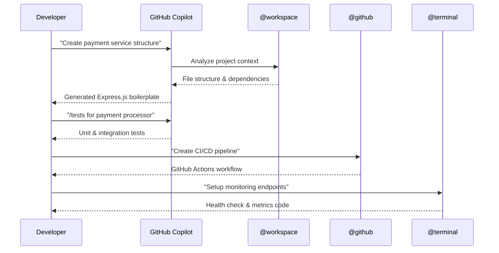

---

## Session 2: Code Modernization

### Legacy Banking App Modernization

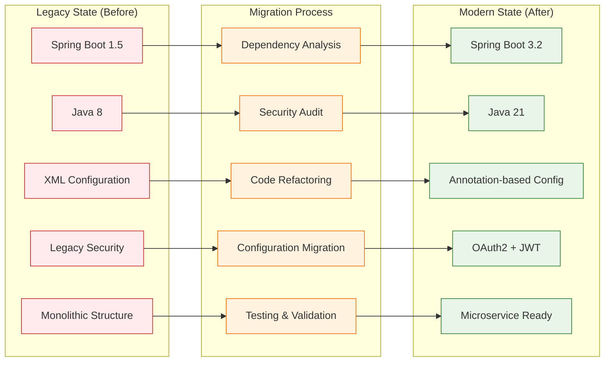

### Modernization Workflow with Copilot

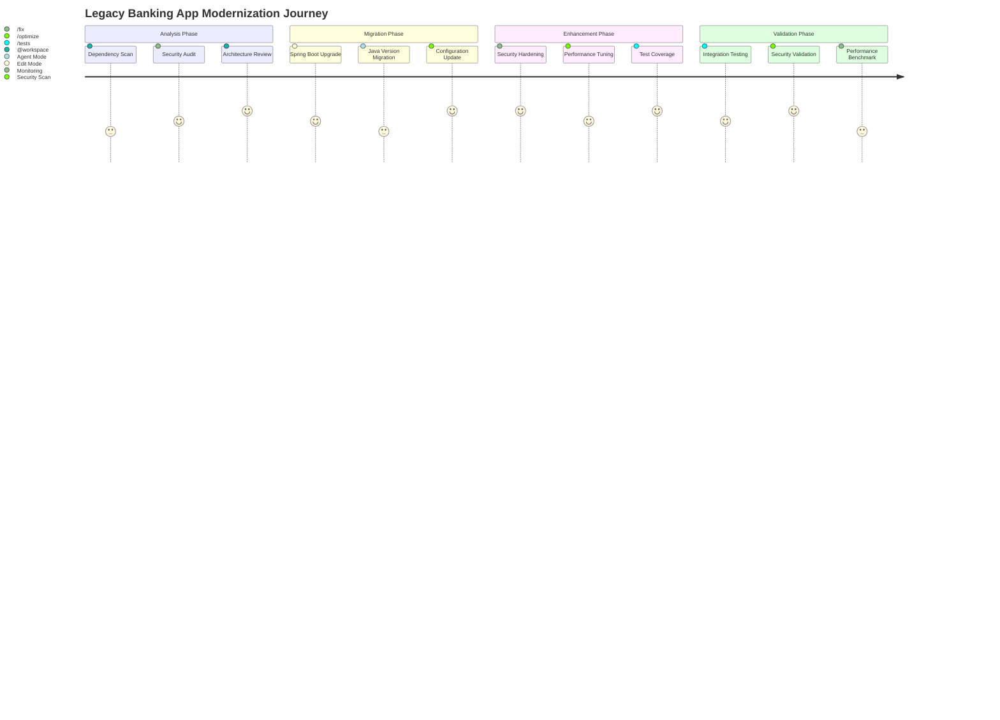

---

## Session 3: Advanced DevOps

### Azure Multi-Region Banking Platform

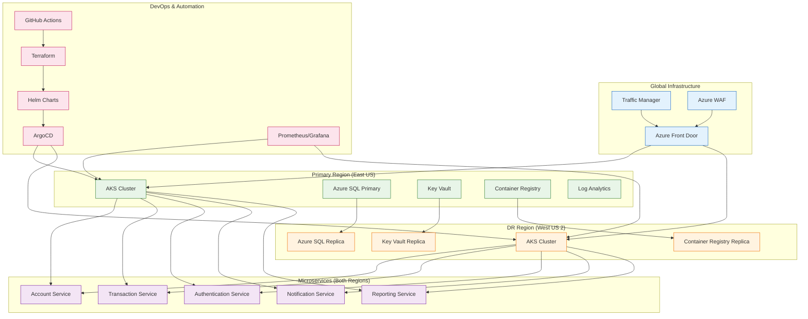

### Kubernetes Deployment Architecture

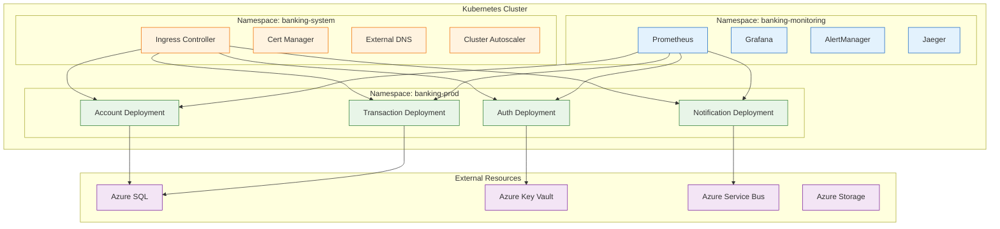

---

## Session 4: Agent Mode Deep Dive

### Multi-Service E-commerce Platform

```mermaid
graph TB
    subgraph "Agent Mode Orchestration"
        AM1[Master Agent]
        AM2[Service Coordinator]
        AM3[Dependency Manager]
        AM4[Quality Assurance]
    end

    subgraph "Frontend Services"
        FS1[Customer Portal - React]
        FS2[Admin Dashboard - Vue.js]
        FS3[Mobile API - GraphQL]
    end

    subgraph "Backend Services"
        BS1[User Service - Node.js]
        BS2[Product Service - Python]
        BS3[Order Service - Go]
        BS4[Payment Service - Java]
        BS5[Analytics Service - Python]
    end

    subgraph "Data Layer"
        DL1[User Database - PostgreSQL]
        DL2[Product Database - MongoDB]
        DL3[Order Database - PostgreSQL]
        DL4[Analytics - ClickHouse]
        DL5[Cache - Redis]
    end

    subgraph "AI/ML Components"
        AI1[Recommendation Engine]
        AI2[Fraud Detection]
        AI3[Price Optimization]
        AI4[Customer Segmentation]
    end

    AM1 --> AM2
    AM2 --> AM3
    AM3 --> AM4

    AM2 --> FS1
    AM2 --> FS2
    AM2 --> FS3

    AM2 --> BS1
    AM2 --> BS2
    AM2 --> BS3
    AM2 --> BS4
    AM2 --> BS5

    BS1 --> DL1
    BS2 --> DL2
    BS3 --> DL3
    BS5 --> DL4
    
    BS1 --> DL5
    BS2 --> DL5
    BS3 --> DL5

    BS5 --> AI1
    BS4 --> AI2
    BS2 --> AI3
    BS1 --> AI4

    classDef agent fill:#e3f2fd,stroke:#1565c0
    classDef frontend fill:#e8f5e8,stroke:#2e7d32
    classDef backend fill:#fff3e0,stroke:#ef6c00
    classDef data fill:#f3e5f5,stroke:#7b1fa2
    classDef ai fill:#fce4ec,stroke:#c2185b

    class AM1,AM2,AM3,AM4 agent
    class FS1,FS2,FS3 frontend
    class BS1,BS2,BS3,BS4,BS5 backend
    class DL1,DL2,DL3,DL4,DL5 data
    class AI1,AI2,AI3,AI4 ai
```

---

## Session 5: Application Maintenance

### Express.js Bug Fixing & Optimization

```mermaid
graph LR
    subgraph "Problem Identification"
        PI1[Memory Leaks]
        PI2[Security Vulnerabilities]
        PI3[Performance Bottlenecks]
        PI4[Logic Errors]
        PI5[Missing Error Handling]
    end

    subgraph "Copilot Assistance"
        CA1[/explain for analysis]
        CA2[/fix for solutions]
        CA3[/tests for validation]
        CA4[/optimize for performance]
    end

    subgraph "Solutions Applied"
        SA1[Connection Pool Management]
        SA2[Input Validation & Sanitization]
        SA3[Database Query Optimization]
        SA4[Business Logic Correction]
        SA5[Comprehensive Error Handling]
    end

    subgraph "Quality Assurance"
        QA1[Unit Test Coverage]
        QA2[Integration Testing]
        QA3[Performance Benchmarks]
        QA4[Security Audit]
    end

    PI1 --> CA1 --> SA1 --> QA1
    PI2 --> CA2 --> SA2 --> QA2
    PI3 --> CA4 --> SA3 --> QA3
    PI4 --> CA2 --> SA4 --> QA1
    PI5 --> CA2 --> SA5 --> QA4

    classDef problem fill:#ffebee,stroke:#c62828
    classDef copilot fill:#e3f2fd,stroke:#1565c0
    classDef solution fill:#e8f5e8,stroke:#2e7d32
    classDef quality fill:#fff3e0,stroke:#ef6c00

    class PI1,PI2,PI3,PI4,PI5 problem
    class CA1,CA2,CA3,CA4 copilot
    class SA1,SA2,SA3,SA4,SA5 solution
    class QA1,QA2,QA3,QA4 quality
```

---

## Session 6: Cross-Language Rewriting

### Java to Go Fraud Detection Service

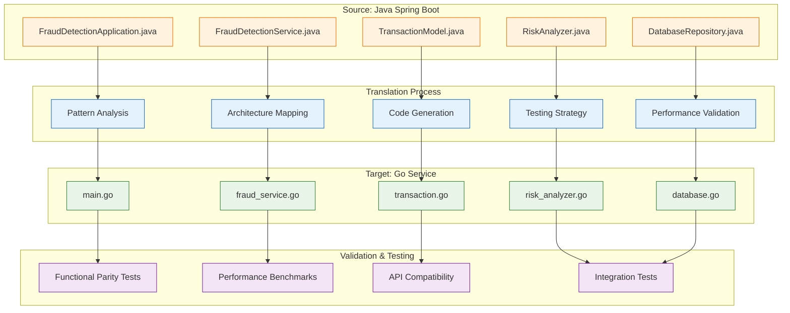

### Language Feature Mapping

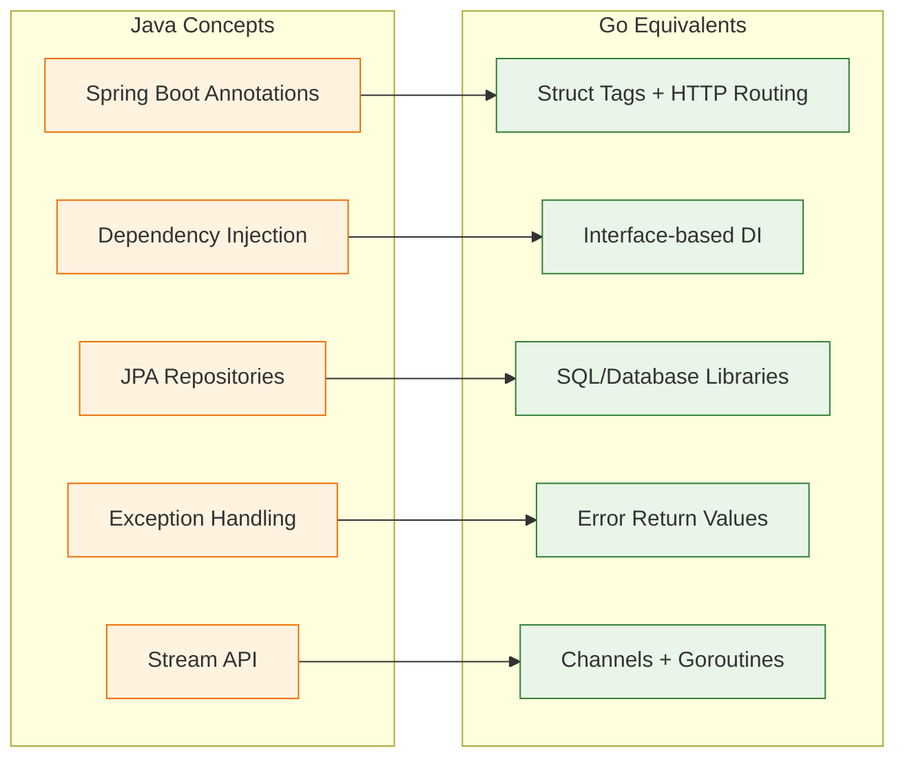

---

## Session 7: Data Science & ML

### Customer Churn Prediction Pipeline

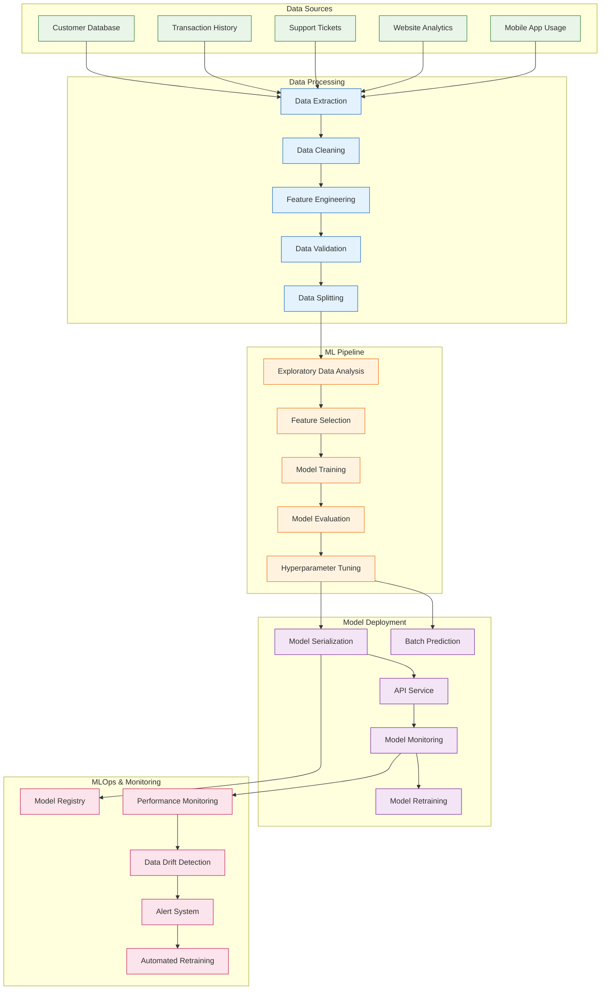

### Copilot-Assisted ML Workflow

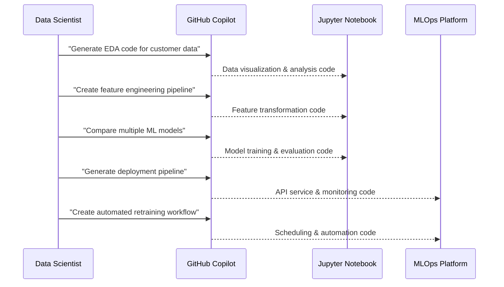

---

## 🔗 Cross-Session Dependencies

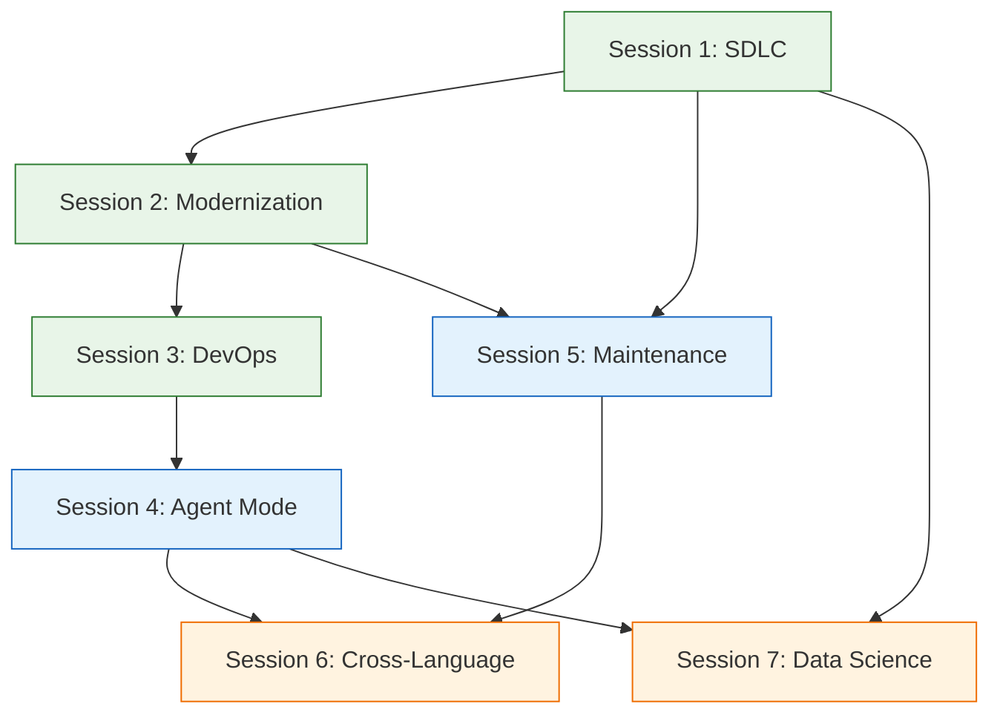