# 🛠️ Technical Architecture & Setup

This document provides comprehensive technical architecture diagrams and setup instructions for the GitHub Copilot Workshop infrastructure.

## 🏗️ Overall Technical Stack

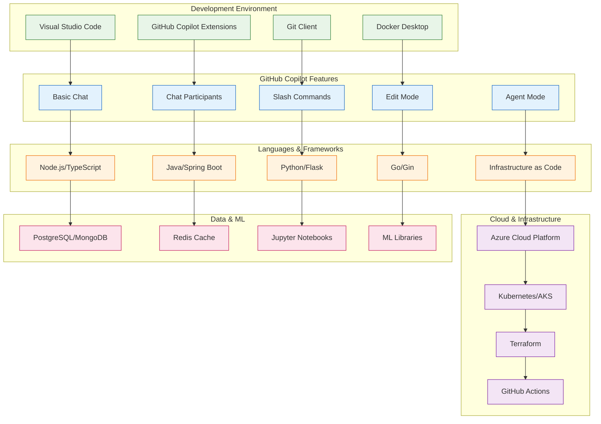

## 💻 Development Environment Setup

### Required Software Installation Flow

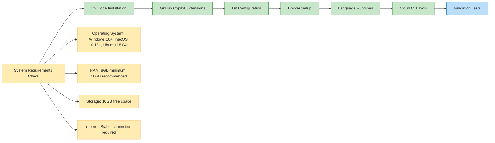

### VS Code Extensions Architecture

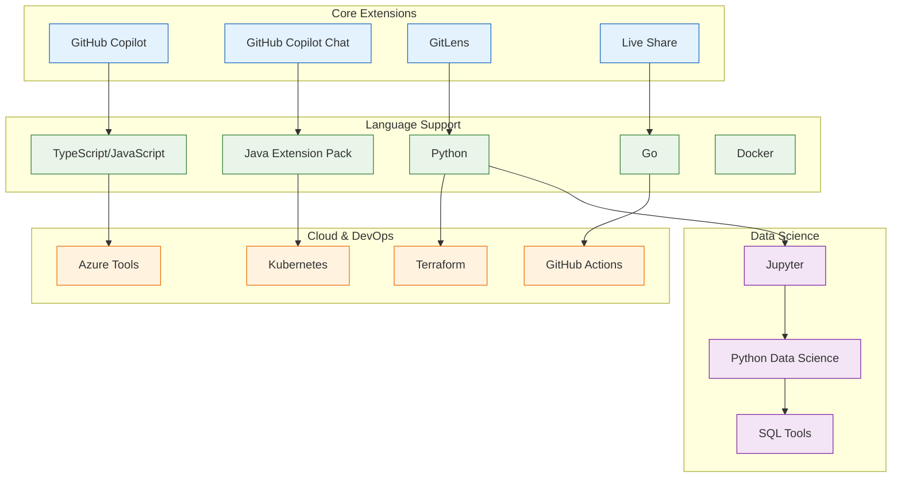

## 🌐 Network Architecture & Requirements

### Network Connectivity Requirements

```mermaid
graph TB
    subgraph "Participant Workstation"
        PW1[VS Code]
        PW2[Docker Desktop]
        PW3[Git Client]
        PW4[Web Browser]
    end

    subgraph "GitHub Services"
        GS1[GitHub.com]
        GS2[GitHub Copilot API]
        GS3[GitHub Actions]
        GS4[GitHub Packages]
    end

    subgraph "Azure Services"
        AS1[Azure Portal]
        AS2[Azure CLI]
        AS3[AKS Clusters]
        AS4[Container Registry]
    end

    subgraph "External Dependencies"
        ED1[Docker Hub]
        ED2[NPM Registry]
        ED3[Maven Central]
        ED4[PyPI]
        ED5[Go Modules Proxy]
    end

    PW1 --> GS1
    PW1 --> GS2
    PW2 --> GS3
    PW3 --> GS4

    PW1 --> AS1
    PW2 --> AS2
    PW3 --> AS3
    PW4 --> AS4

    PW1 --> ED1
    PW2 --> ED2
    PW3 --> ED3
    PW4 --> ED4
    PW1 --> ED5

    classDef workstation fill:#e8f5e8,stroke:#2e7d32
    classDef github fill:#e3f2fd,stroke:#1565c0
    classDef azure fill:#fff3e0,stroke:#ef6c00
    classDef external fill:#f3e5f5,stroke:#7b1fa2

    class PW1,PW2,PW3,PW4 workstation
    class GS1,GS2,GS3,GS4 github
    class AS1,AS2,AS3,AS4 azure
    class ED1,ED2,ED3,ED4,ED5 external
```

### Firewall & Security Requirements

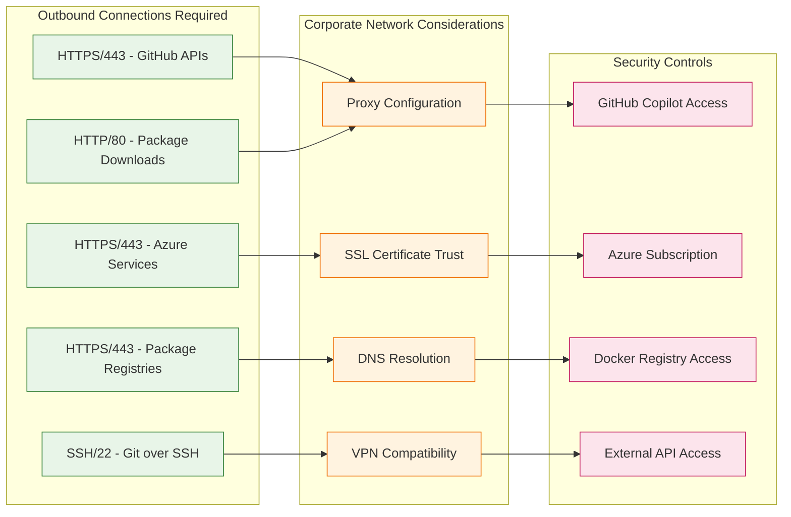

## 🔧 Environment Validation Process

### Automated Validation Script Architecture

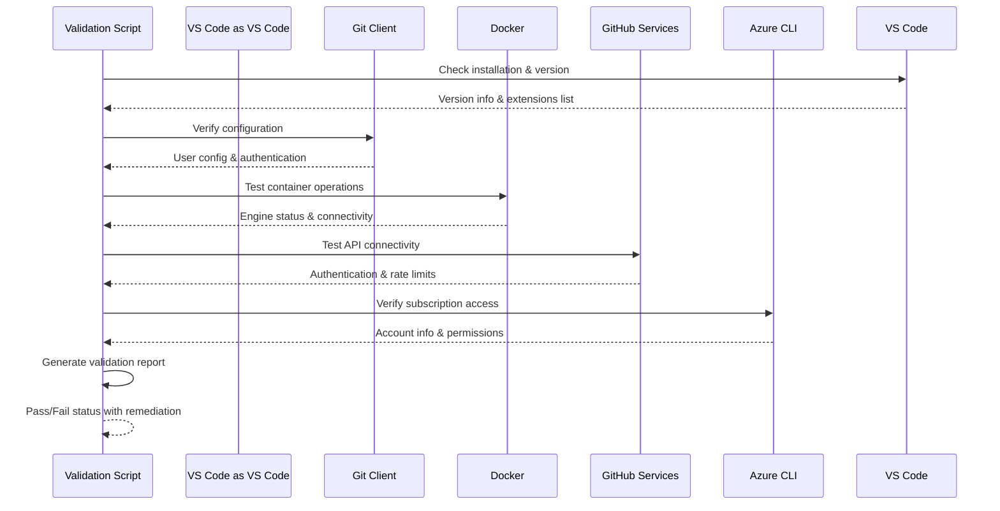

### Validation Checklist Flow

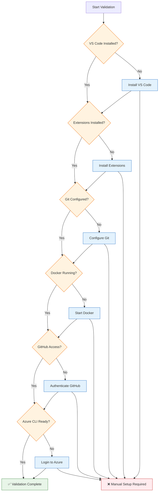

## 🎯 Session-Specific Technical Requirements

### Session 1: Payment Service Technical Stack

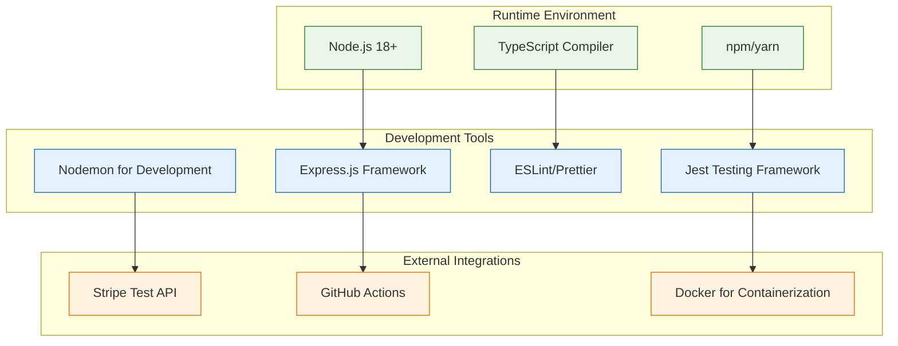

### Session 2: Java Modernization Stack

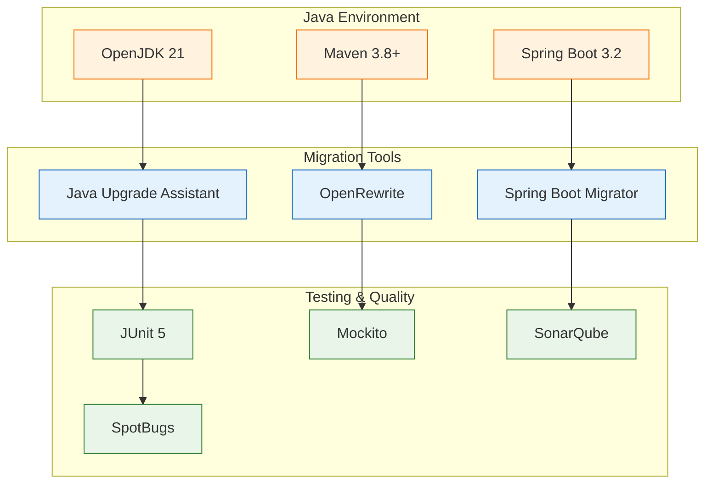

### Session 3: DevOps Infrastructure Stack

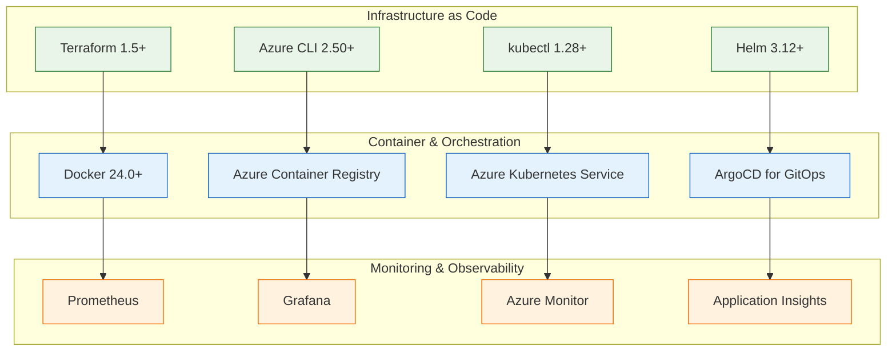

## 📊 Resource Requirements & Scaling

### Compute Resource Requirements

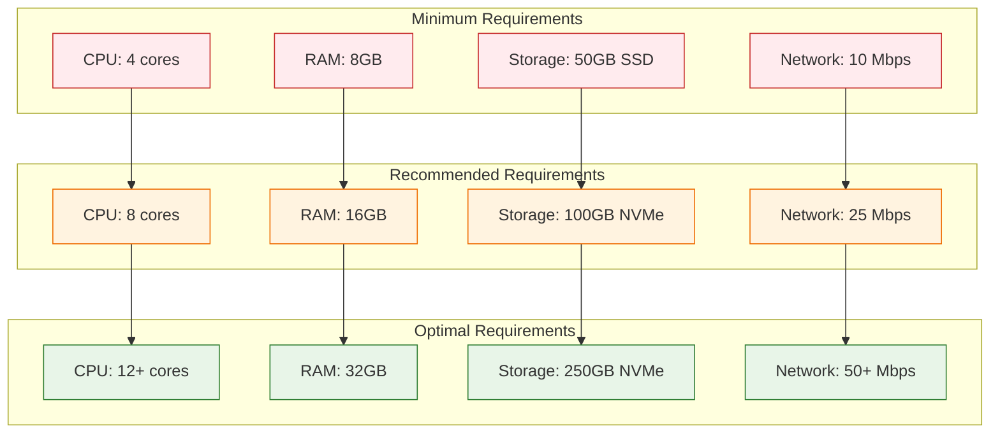

### Cloud Resource Architecture

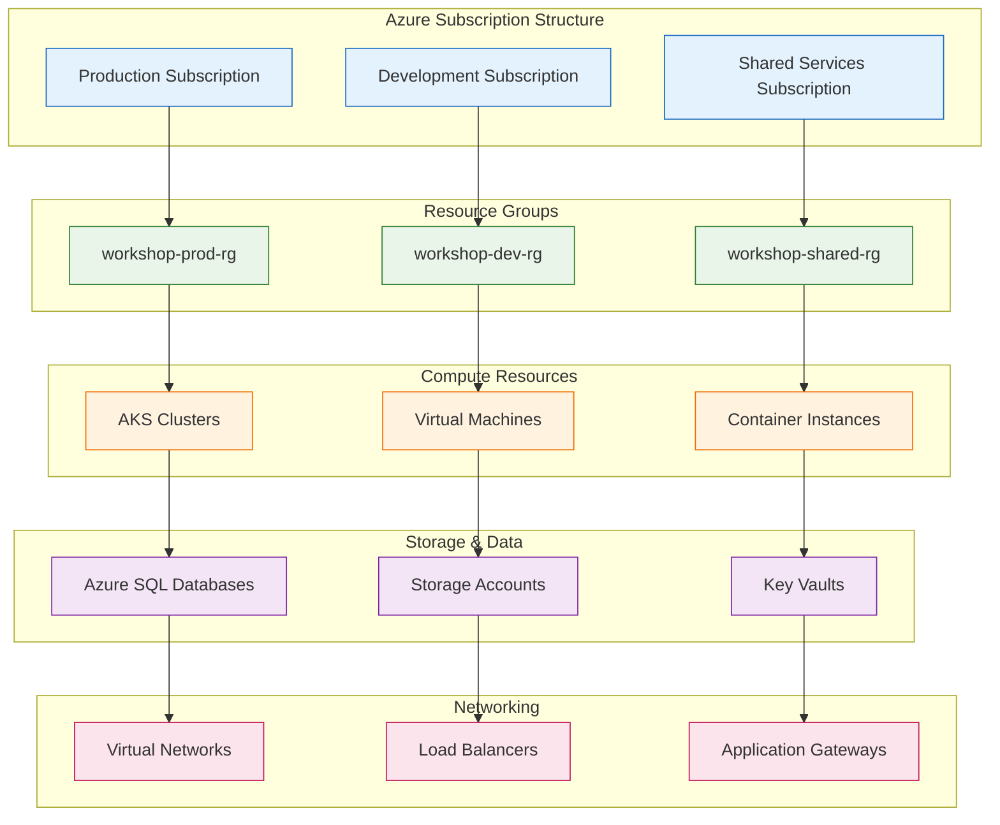

## 🔄 Disaster Recovery & Backup

### Backup Strategy Architecture

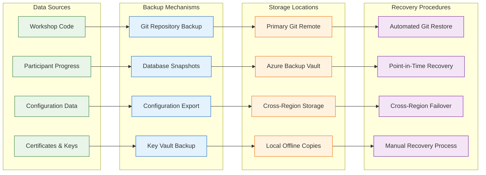

## 📈 Performance Monitoring & Optimization

### Performance Metrics Dashboard Architecture

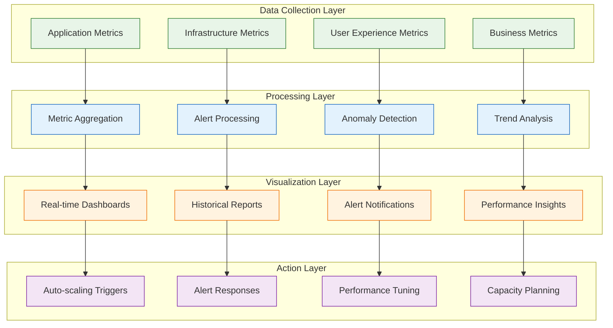