# 🏗️ Workshop Architecture Overview

This document provides comprehensive architectural documentation for the GitHub Copilot Mastery Workshop, including the overall structure, session progression, and learning flow.

## 🎯 Workshop Flow Diagram

```mermaid
flowchart TD
    A[👥 Pre-Workshop Setup] --> B[🎯 Session 1: AI-Powered SDLC]
    B --> C[🔧 Session 2: Code Modernization]
    C --> D[🚀 Session 3: Advanced DevOps]
    D --> E[🤖 Session 4: Agent Mode Deep Dive]
    E --> F[🧪 Session 5: Application Maintenance]
    F --> G[🌐 Session 6: Cross-Language Rewriting]
    G --> H[📊 Session 7: Data Science & ML]
    H --> I[🎉 Workshop Wrap-Up]

    A -->|Environment Setup| A1[VS Code + Extensions]
    A -->|Account Setup| A2[GitHub + Copilot Access]
    A -->|Skill Assessment| A3[Baseline Evaluation]

    B -->|Output| B1[Payment Service + CI/CD]
    C -->|Output| C1[Modernized Banking App]
    D -->|Output| D1[Azure Infrastructure]
    E -->|Output| E1[Multi-Service Platform]
    F -->|Output| F1[Debugged Application]
    G -->|Output| G1[Go Fraud Service]
    H -->|Output| H1[ML Churn Model]

    I --> J[📈 Skills Certification]
    I --> K[🤝 Community Access]
    I --> L[📚 Continued Learning]

    classDef sessionClass fill:#e1f5fe,stroke:#01579b,stroke-width:2px
    classDef outputClass fill:#f3e5f5,stroke:#4a148c,stroke-width:2px
    classDef setupClass fill:#e8f5e8,stroke:#2e7d32,stroke-width:2px

    class B,C,D,E,F,G,H sessionClass
    class B1,C1,D1,E1,F1,G1,H1 outputClass
    class A,A1,A2,A3 setupClass
```



## 📊 Skill Progression Matrix


## 🎮 Gamification Architecture


## 🧠 Copilot Features Progression


## 🏢 Business Scenario Architecture


## 🎯 Learning Objectives Hierarchy

```mermaid
graph TD
    A[GitHub Copilot Mastery] --> B[Basic Proficiency]
    A --> C[Advanced Usage]
    A --> D[Expert Implementation]

    B --> B1[Chat Commands]
    B --> B2[Code Generation]
    B --> B3[Simple Debugging]

    C --> C1[Context Management]
    C --> C2[Multi-file Operations]
    C --> C3[Complex Prompting]

    D --> D1[Autonomous Development]
    D --> D2[Architecture Design]
    D --> D3[Cross-Language Translation]

    B1 --> B1A[Basic Q&A]
    B1 --> B1B[Code Explanation]
    B2 --> B2A[Function Generation]
    B2 --> B2B[API Creation]
    B3 --> B3A[Error Fixing]
    B3 --> B3B[Simple Optimization]

    C1 --> C1A[@workspace Usage]
    C1 --> C1B[Project Understanding]
    C2 --> C2A[Refactoring]
    C2 --> C2B[Architecture Changes]
    C3 --> C3A[Detailed Prompts]
    C3 --> C3B[Business Context]

    D1 --> D1A[Agent Mode]
    D1 --> D1B[Multi-service Coordination]
    D2 --> D2A[System Architecture]
    D2 --> D2B[Infrastructure Design]
    D3 --> D3A[Language Migration]
    D3 --> D3B[Pattern Translation]

    classDef level1 fill:#e8f5e8,stroke:#2e7d32
    classDef level2 fill:#e3f2fd,stroke:#1565c0
    classDef level3 fill:#fce4ec,stroke:#c2185b
    classDef level4 fill:#fff3e0,stroke:#ef6c00

    class A level1
    class B,C,D level2
    class B1,B2,B3,C1,C2,C3,D1,D2,D3 level3
    class B1A,B1B,B2A,B2B,B3A,B3B,C1A,C1B,C2A,C2B,C3A,C3B,D1A,D1B,D2A,D2B,D3A,D3B level4
```

## 🔄 Workshop Dependencies


## 📈 Success Metrics Framework

