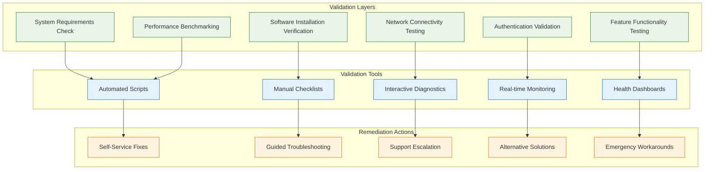
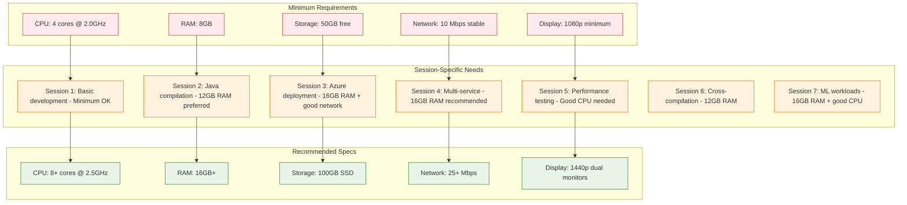
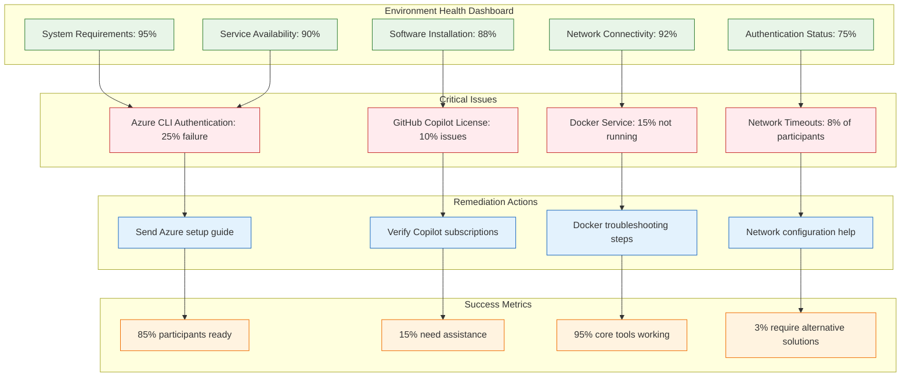
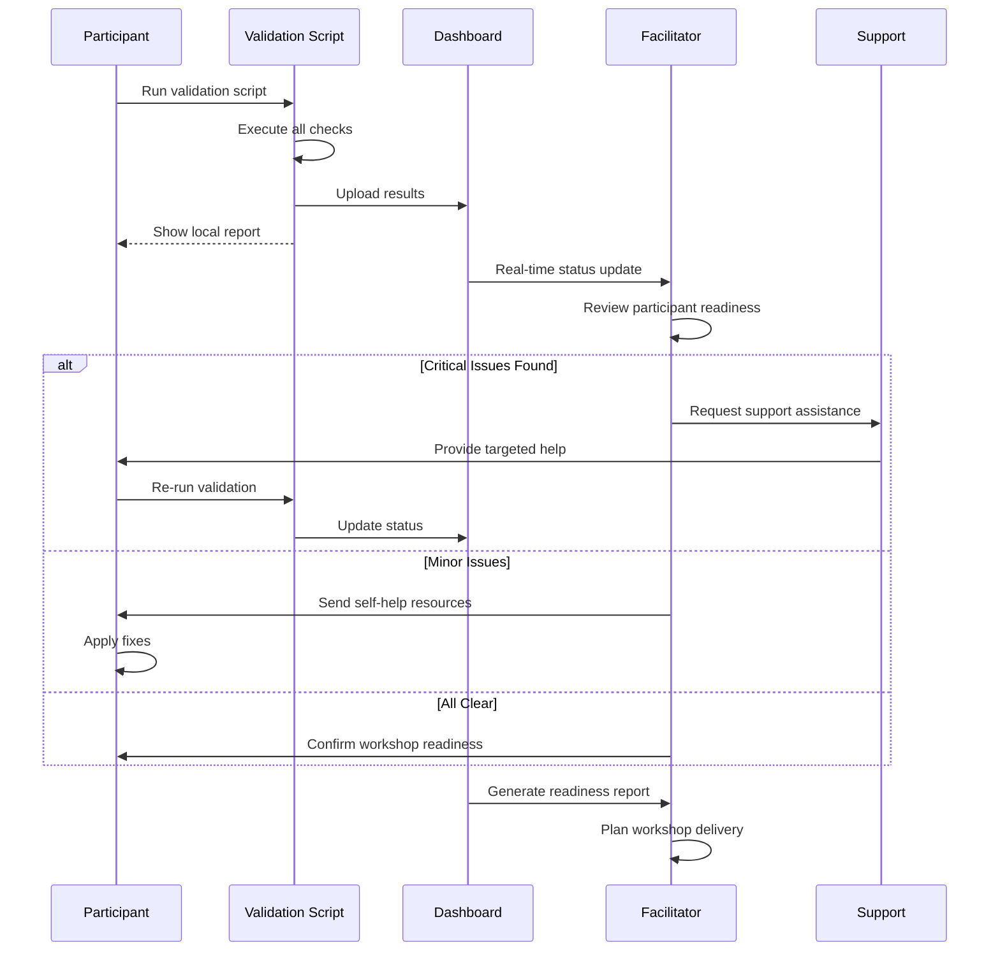
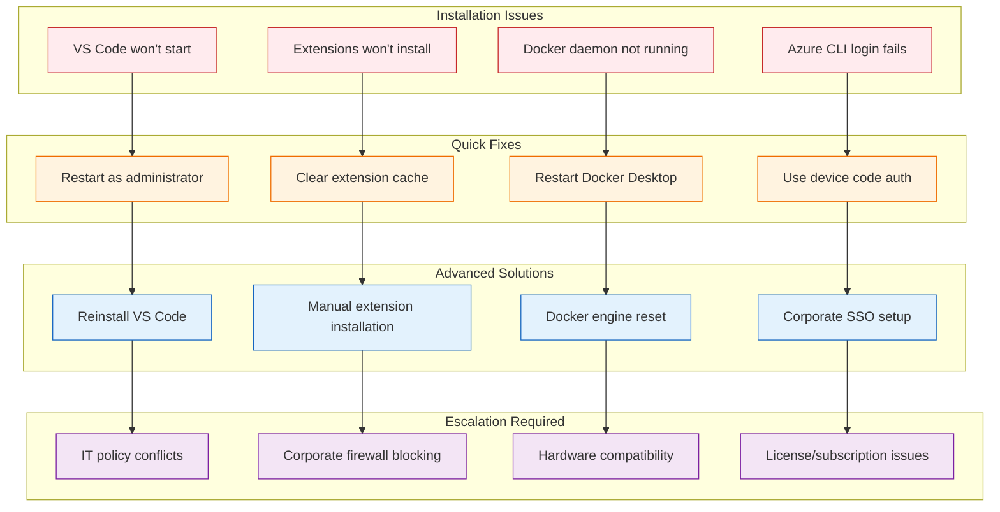

# 🔍 Environment Validation Documentation

This document provides comprehensive guidance for validating workshop environments, ensuring all participants have properly configured systems before and during the workshop.

## 🎯 Validation Framework Overview



## 🖥️ System Requirements Matrix

### Hardware Requirements by Session



### Operating System Compatibility

```mermaid
graph LR
    subgraph "Fully Supported"
        FS1[Windows 10 20H2+]
        FS2[Windows 11]
        FS3[macOS 10.15+]
        FS4[macOS 11+ (recommended)]
        FS5[Ubuntu 18.04 LTS+]
        FS6[Ubuntu 20.04 LTS+ (recommended)]
    end

    subgraph "Limited Support"
        LS1[Windows 10 1909-20H1]
        LS2[macOS 10.14]
        LS3[CentOS 8]
        LS4[Fedora 32+]
        LS5[openSUSE Leap 15.2+]
    end

    subgraph "Not Recommended"
        NR1[Windows 7/8]
        NR2[macOS 10.13 and older]
        NR3[Ubuntu 16.04 and older]
        NR4[32-bit systems]
    end

    FS1 --> Success[✅ Workshop Ready]
    FS2 --> Success
    FS3 --> Success
    FS4 --> Success
    FS5 --> Success
    FS6 --> Success

    LS1 --> Warning[⚠️ May Have Issues]
    LS2 --> Warning
    LS3 --> Warning
    LS4 --> Warning
    LS5 --> Warning

    NR1 --> NotSupported[❌ Not Supported]
    NR2 --> NotSupported
    NR3 --> NotSupported
    NR4 --> NotSupported

    classDef supported fill:#e8f5e8,stroke:#2e7d32
    classDef limited fill:#fff3e0,stroke:#ef6c00
    classDef unsupported fill:#ffebee,stroke:#c62828
    classDef result fill:#e3f2fd,stroke:#1565c0

    class FS1,FS2,FS3,FS4,FS5,FS6 supported
    class LS1,LS2,LS3,LS4,LS5 limited
    class NR1,NR2,NR3,NR4 unsupported
    class Success,Warning,NotSupported result
```

## 🔧 Comprehensive Validation Script

### Master Validation Script

```bash
#!/bin/bash
# GitHub Copilot Workshop Environment Validation
# Version: 2.0
# Last Updated: 2024-01-15

set -e  # Exit on any error

# Color codes and formatting
RED='\033[0;31m'
GREEN='\033[0;32m'
YELLOW='\033[1;33m'
BLUE='\033[0;34m'
PURPLE='\033[0;35m'
CYAN='\033[0;36m'
WHITE='\033[1;37m'
NC='\033[0m' # No Color

# Validation results tracking
TOTAL_CHECKS=0
PASSED_CHECKS=0
FAILED_CHECKS=0
WARNING_CHECKS=0

# Logging
LOG_FILE="workshop_validation_$(date +%Y%m%d_%H%M%S).log"

log() {
    echo "$(date '+%Y-%m-%d %H:%M:%S') - $1" >> "$LOG_FILE"
}

print_header() {
    echo -e "${CYAN}=================================================${NC}"
    echo -e "${WHITE}🧪 GitHub Copilot Workshop Environment Validation${NC}"
    echo -e "${CYAN}=================================================${NC}"
    echo -e "${BLUE}Version: 2.0 | Date: $(date '+%Y-%m-%d %H:%M:%S')${NC}"
    echo -e "${BLUE}Log file: $LOG_FILE${NC}"
    echo ""
}

# Enhanced check functions
check_status() {
    local result=$1
    local message=$2
    local level=${3:-"info"}
    
    TOTAL_CHECKS=$((TOTAL_CHECKS + 1))
    
    case $result in
        0)
            echo -e "${GREEN}✅ $message${NC}"
            PASSED_CHECKS=$((PASSED_CHECKS + 1))
            log "PASS: $message"
            ;;
        1)
            echo -e "${RED}❌ $message${NC}"
            FAILED_CHECKS=$((FAILED_CHECKS + 1))
            log "FAIL: $message"
            ;;
        2)
            echo -e "${YELLOW}⚠️ $message${NC}"
            WARNING_CHECKS=$((WARNING_CHECKS + 1))
            log "WARN: $message"
            ;;
    esac
}

check_command_with_version() {
    local cmd=$1
    local name=$2
    local version_cmd=$3
    local min_version=${4:-""}
    
    if command -v $cmd &> /dev/null; then
        local version=$(eval $version_cmd 2>/dev/null | head -1)
        if [ -n "$min_version" ]; then
            check_status 0 "$name is installed ($version)"
            echo -e "   ${CYAN}📋 Minimum required: $min_version${NC}"
        else
            check_status 0 "$name is installed ($version)"
        fi
        return 0
    else
        check_status 1 "$name is not installed"
        return 1
    fi
}

check_network_connectivity() {
    local url=$1
    local name=$2
    local timeout=${3:-5}
    
    if curl -s --max-time $timeout --connect-timeout $timeout "$url" > /dev/null 2>&1; then
        check_status 0 "$name is accessible"
        return 0
    else
        check_status 1 "$name is not accessible (timeout: ${timeout}s)"
        return 1
    fi
}

check_port_availability() {
    local port=$1
    local name=$2
    
    if ! lsof -i:$port > /dev/null 2>&1; then
        check_status 0 "Port $port is available for $name"
        return 0
    else
        check_status 2 "Port $port is in use (may conflict with $name)"
        return 2
    fi
}

check_disk_space() {
    local min_space_gb=$1
    local available_gb=$(df . | awk 'NR==2 {print int($4/1024/1024)}')
    
    if [ $available_gb -ge $min_space_gb ]; then
        check_status 0 "Sufficient disk space (${available_gb}GB available, ${min_space_gb}GB required)"
        return 0
    else
        check_status 1 "Insufficient disk space (${available_gb}GB available, ${min_space_gb}GB required)"
        return 1
    fi
}

check_memory() {
    local min_memory_gb=$1
    
    if [[ "$OSTYPE" == "darwin"* ]]; then
        local total_memory_gb=$(echo "$(sysctl -n hw.memsize) / 1024 / 1024 / 1024" | bc)
    elif [[ "$OSTYPE" == "linux-gnu"* ]]; then
        local total_memory_gb=$(free -g | awk 'NR==2{print $2}')
    else
        # Windows (Git Bash/WSL)
        local total_memory_kb=$(wmic computersystem get TotalPhysicalMemory /value 2>/dev/null | grep -o '[0-9]*' | head -1)
        local total_memory_gb=$((total_memory_kb / 1024 / 1024 / 1024))
    fi
    
    if [ $total_memory_gb -ge $min_memory_gb ]; then
        check_status 0 "Sufficient memory (${total_memory_gb}GB total, ${min_memory_gb}GB required)"
        return 0
    else
        check_status 1 "Insufficient memory (${total_memory_gb}GB total, ${min_memory_gb}GB required)"
        return 1
    fi
}

# System requirements validation
validate_system_requirements() {
    echo -e "${PURPLE}🖥️ System Requirements${NC}"
    echo "========================"
    
    # Memory check
    check_memory 8
    
    # Disk space check
    check_disk_space 50
    
    # CPU cores (rough estimate)
    if [[ "$OSTYPE" == "darwin"* ]]; then
        local cpu_cores=$(sysctl -n hw.ncpu)
    elif [[ "$OSTYPE" == "linux-gnu"* ]]; then
        local cpu_cores=$(nproc)
    else
        local cpu_cores=$(wmic cpu get NumberOfCores /value 2>/dev/null | grep -o '[0-9]*' | head -1)
    fi
    
    if [ $cpu_cores -ge 4 ]; then
        check_status 0 "Sufficient CPU cores ($cpu_cores cores, 4+ recommended)"
    else
        check_status 2 "Limited CPU cores ($cpu_cores cores, 4+ recommended)"
    fi
    
    echo ""
}

# Software installation validation
validate_software_installation() {
    echo -e "${PURPLE}💾 Software Installation${NC}"
    echo "========================="
    
    # Core development tools
    check_command_with_version "code" "Visual Studio Code" "code --version | head -1" "1.85+"
    check_command_with_version "git" "Git" "git --version" "2.30+"
    check_command_with_version "docker" "Docker" "docker --version" "24.0+"
    
    # Language runtimes
    check_command_with_version "node" "Node.js" "node --version" "18+"
    check_command_with_version "npm" "npm" "npm --version" "9+"
    check_command_with_version "java" "Java" "java -version 2>&1 | head -1" "11+"
    
    # Check Python (try python3 first, then python)
    if command -v python3 &> /dev/null; then
        check_command_with_version "python3" "Python" "python3 --version" "3.8+"
    elif command -v python &> /dev/null; then
        check_command_with_version "python" "Python" "python --version" "3.8+"
    else
        check_status 1 "Python is not installed"
    fi
    
    # Cloud tools
    check_command_with_version "az" "Azure CLI" "az --version | head -1" "2.50+"
    check_command_with_version "kubectl" "kubectl" "kubectl version --client --short 2>/dev/null" "1.25+"
    check_command_with_version "terraform" "Terraform" "terraform --version | head -1" "1.5+"
    
    # Optional but helpful
    if command -v gh &> /dev/null; then
        check_command_with_version "gh" "GitHub CLI" "gh --version | head -1" "2.20+"
    else
        check_status 2 "GitHub CLI not installed (optional but recommended)"
    fi
    
    echo ""
}

# VS Code extensions validation
validate_vscode_extensions() {
    echo -e "${PURPLE}🧩 VS Code Extensions${NC}"
    echo "======================="
    
    if ! command -v code &> /dev/null; then
        check_status 1 "VS Code not available - cannot check extensions"
        echo ""
        return
    fi
    
    local extensions=$(code --list-extensions 2>/dev/null)
    
    # Essential extensions
    if echo "$extensions" | grep -q "github.copilot"; then
        check_status 0 "GitHub Copilot extension installed"
    else
        check_status 1 "GitHub Copilot extension not installed"
    fi
    
    if echo "$extensions" | grep -q "github.copilot-chat"; then
        check_status 0 "GitHub Copilot Chat extension installed"
    else
        check_status 1 "GitHub Copilot Chat extension not installed"
    fi
    
    # Recommended extensions
    local recommended_extensions=(
        "ms-vscode.azure-account:Azure Account"
        "ms-azuretools.vscode-docker:Docker"
        "eamodio.gitlens:GitLens"
        "ms-vsliveshare.vsliveshare:Live Share"
        "redhat.vscode-yaml:YAML"
    )
    
    for ext_info in "${recommended_extensions[@]}"; do
        local ext_id="${ext_info%%:*}"
        local ext_name="${ext_info##*:}"
        
        if echo "$extensions" | grep -q "$ext_id"; then
            check_status 0 "$ext_name extension installed"
        else
            check_status 2 "$ext_name extension not installed (recommended)"
        fi
    done
    
    echo ""
}

# Network connectivity validation
validate_network_connectivity() {
    echo -e "${PURPLE}🌐 Network Connectivity${NC}"
    echo "========================"
    
    # Essential services
    check_network_connectivity "https://api.github.com" "GitHub API" 10
    check_network_connectivity "https://github.com" "GitHub.com" 5
    check_network_connectivity "https://management.azure.com" "Azure Management API" 10
    
    # Package registries
    check_network_connectivity "https://registry.npmjs.org" "NPM Registry" 5
    check_network_connectivity "https://repo1.maven.org/maven2/" "Maven Central" 5
    check_network_connectivity "https://pypi.org" "Python Package Index" 5
    check_network_connectivity "https://hub.docker.com" "Docker Hub" 5
    
    # Additional services
    check_network_connectivity "https://marketplace.visualstudio.com" "VS Code Marketplace" 5
    check_network_connectivity "https://releases.hashicorp.com" "HashiCorp Releases" 5
    
    echo ""
}

# Authentication validation
validate_authentication() {
    echo -e "${PURPLE}🔑 Authentication${NC}"
    echo "=================="
    
    # Git configuration
    local git_user=$(git config user.name 2>/dev/null || echo "")
    local git_email=$(git config user.email 2>/dev/null || echo "")
    
    if [ -n "$git_user" ] && [ -n "$git_email" ]; then
        check_status 0 "Git user configured ($git_user <$git_email>)"
    else
        check_status 1 "Git user not configured"
    fi
    
    # GitHub authentication
    if command -v gh &> /dev/null && gh auth status &> /dev/null; then
        local gh_user=$(gh api user --jq .login 2>/dev/null || echo "unknown")
        check_status 0 "GitHub CLI authenticated (user: $gh_user)"
    elif ssh -T git@github.com 2>&1 | grep -q "successfully authenticated"; then
        check_status 0 "GitHub SSH authentication working"
    else
        check_status 2 "GitHub authentication not verified (may need setup)"
    fi
    
    # Azure authentication
    if command -v az &> /dev/null && az account show &> /dev/null; then
        local az_user=$(az account show --query user.name -o tsv 2>/dev/null || echo "unknown")
        local az_subscription=$(az account show --query name -o tsv 2>/dev/null || echo "unknown")
        check_status 0 "Azure CLI authenticated (user: $az_user, subscription: $az_subscription)"
    else
        check_status 2 "Azure CLI not authenticated (needed for Session 3)"
    fi
    
    echo ""
}

# Docker service validation
validate_docker_service() {
    echo -e "${PURPLE}🐳 Docker Service${NC}"
    echo "=================="
    
    if ! command -v docker &> /dev/null; then
        check_status 1 "Docker not installed"
        echo ""
        return
    fi
    
    # Check if Docker daemon is running
    if docker info &> /dev/null; then
        check_status 0 "Docker daemon is running"
        
        # Check Docker version and capabilities
        local docker_version=$(docker --version | cut -d' ' -f3 | cut -d',' -f1)
        echo -e "   ${CYAN}📋 Docker version: $docker_version${NC}"
        
        # Test basic Docker functionality
        if docker run --rm hello-world &> /dev/null; then
            check_status 0 "Docker can run containers"
        else
            check_status 1 "Docker cannot run containers"
        fi
        
        # Check available resources
        local docker_memory=$(docker system info --format '{{.MemTotal}}' 2>/dev/null)
        if [ -n "$docker_memory" ]; then
            local memory_gb=$((docker_memory / 1024 / 1024 / 1024))
            if [ $memory_gb -ge 4 ]; then
                check_status 0 "Docker has sufficient memory allocated (${memory_gb}GB)"
            else
                check_status 2 "Docker has limited memory allocated (${memory_gb}GB, 4GB+ recommended)"
            fi
        fi
        
    else
        check_status 1 "Docker daemon is not running"
    fi
    
    echo ""
}

# Port availability validation
validate_port_availability() {
    echo -e "${PURPLE}🔌 Port Availability${NC}"
    echo "===================="
    
    # Common ports used in workshop
    local workshop_ports=(
        "3000:Express.js (Session 1)"
        "8080:Spring Boot (Session 2)"
        "80:HTTP (Session 3)"
        "443:HTTPS (Session 3)"
        "5000:Flask (Session 7)"
        "8888:Jupyter (Session 7)"
    )
    
    for port_info in "${workshop_ports[@]}"; do
        local port="${port_info%%:*}"
        local service="${port_info##*:}"
        check_port_availability "$port" "$service"
    done
    
    echo ""
}

# GitHub Copilot specific validation
validate_github_copilot() {
    echo -e "${PURPLE}🤖 GitHub Copilot${NC}"
    echo "=================="
    
    if ! command -v code &> /dev/null; then
        check_status 1 "VS Code not available - cannot test Copilot"
        echo ""
        return
    fi
    
    # Check if Copilot extensions are installed and enabled
    local extensions=$(code --list-extensions 2>/dev/null)
    
    if echo "$extensions" | grep -q "github.copilot"; then
        check_status 0 "GitHub Copilot extension detected"
        
        # Try to check Copilot status (this requires VS Code to be running)
        echo -e "   ${CYAN}💡 To verify Copilot is working:${NC}"
        echo -e "   ${CYAN}   1. Open VS Code${NC}"
        echo -e "   ${CYAN}   2. Press Ctrl+Shift+P (Cmd+Shift+P on Mac)${NC}"
        echo -e "   ${CYAN}   3. Type 'GitHub Copilot: Show Status'${NC}"
        echo -e "   ${CYAN}   4. Ensure you see 'GitHub Copilot is ready'${NC}"
        
    else
        check_status 1 "GitHub Copilot extension not found"
    fi
    
    echo ""
}

# Performance benchmarking
validate_performance() {
    echo -e "${PURPLE}⚡ Performance Benchmarking${NC}"
    echo "==========================="
    
    # Simple Node.js performance test
    if command -v node &> /dev/null; then
        echo -e "${CYAN}Testing Node.js performance...${NC}"
        local node_start=$(date +%s%N)
        node -e "console.log('Node.js is working')" &> /dev/null
        local node_end=$(date +%s%N)
        local node_time_ms=$(( (node_end - node_start) / 1000000 ))
        
        if [ $node_time_ms -lt 1000 ]; then
            check_status 0 "Node.js startup time is good (${node_time_ms}ms)"
        else
            check_status 2 "Node.js startup time is slow (${node_time_ms}ms)"
        fi
    fi
    
    # Simple network speed test
    echo -e "${CYAN}Testing network performance...${NC}"
    local network_start=$(date +%s%N)
    curl -s https://api.github.com > /dev/null
    local network_end=$(date +%s%N)
    local network_time_ms=$(( (network_end - network_start) / 1000000 ))
    
    if [ $network_time_ms -lt 2000 ]; then
        check_status 0 "Network response time is good (${network_time_ms}ms)"
    elif [ $network_time_ms -lt 5000 ]; then
        check_status 2 "Network response time is acceptable (${network_time_ms}ms)"
    else
        check_status 1 "Network response time is slow (${network_time_ms}ms)"
    fi
    
    echo ""
}

# Generate final report
generate_final_report() {
    echo -e "${CYAN}=================================================${NC}"
    echo -e "${WHITE}📊 Validation Summary${NC}"
    echo -e "${CYAN}=================================================${NC}"
    
    local success_rate=$((PASSED_CHECKS * 100 / TOTAL_CHECKS))
    
    echo -e "${GREEN}✅ Passed: $PASSED_CHECKS${NC}"
    echo -e "${RED}❌ Failed: $FAILED_CHECKS${NC}"
    echo -e "${YELLOW}⚠️ Warnings: $WARNING_CHECKS${NC}"
    echo -e "${BLUE}📊 Total: $TOTAL_CHECKS${NC}"
    echo -e "${PURPLE}📈 Success Rate: ${success_rate}%${NC}"
    
    echo ""
    
    if [ $FAILED_CHECKS -eq 0 ] && [ $WARNING_CHECKS -eq 0 ]; then
        echo -e "${GREEN}🎉 Perfect! Your environment is fully ready for the workshop!${NC}"
    elif [ $FAILED_CHECKS -eq 0 ]; then
        echo -e "${YELLOW}⚠️ Good! Minor issues detected but workshop should work fine.${NC}"
        echo -e "${YELLOW}   Consider addressing warnings for optimal experience.${NC}"
    elif [ $FAILED_CHECKS -le 3 ] && [ $success_rate -ge 80 ]; then
        echo -e "${YELLOW}🔧 Mostly ready! Please address the failed items before the workshop.${NC}"
        echo -e "${YELLOW}   Contact support if you need help with any failed checks.${NC}"
    else
        echo -e "${RED}❌ Environment needs attention! Multiple issues detected.${NC}"
        echo -e "${RED}   Please resolve failed items or contact support for assistance.${NC}"
    fi
    
    echo ""
    echo -e "${BLUE}📝 Detailed log saved to: $LOG_FILE${NC}"
    echo -e "${BLUE}📧 Share this log with support if you need help.${NC}"
    
    # Additional resources
    echo ""
    echo -e "${CYAN}🔗 Helpful Resources:${NC}"
    echo -e "${CYAN}   • Setup Guide: docs/implementation/participant-prep.md${NC}"
    echo -e "${CYAN}   • Troubleshooting: docs/visual-guides/troubleshooting.md${NC}"
    echo -e "${CYAN}   • Support Email: workshop-support@example.com${NC}"
}

# Main execution
main() {
    print_header
    
    validate_system_requirements
    validate_software_installation
    validate_vscode_extensions
    validate_network_connectivity
    validate_authentication
    validate_docker_service
    validate_port_availability
    validate_github_copilot
    validate_performance
    
    generate_final_report
}

# Run the validation
main "$@"
```

## 📊 Validation Results Dashboard

### Real-time Validation Status



### Validation Reporting



## 🚨 Common Validation Issues & Solutions

### Issue Resolution Matrix



### Automated Fix Scripts

```bash
#!/bin/bash
# Quick Fix Scripts for Common Validation Issues

# Fix VS Code Extension Issues
fix_vscode_extensions() {
    echo "🔧 Fixing VS Code extension issues..."
    
    # Clear extension cache
    rm -rf ~/.vscode/extensions/.obsolete
    
    # Reset extension host
    code --uninstall-extension github.copilot
    code --install-extension github.copilot
    
    # Force reload
    code --command workbench.action.reloadWindow
    
    echo "✅ VS Code extensions reset"
}

# Fix Docker Issues
fix_docker_issues() {
    echo "🔧 Fixing Docker issues..."
    
    # Try to start Docker service
    if [[ "$OSTYPE" == "darwin"* ]]; then
        open -a Docker
        echo "Started Docker Desktop on macOS"
    elif [[ "$OSTYPE" == "linux-gnu"* ]]; then
        sudo systemctl start docker
        echo "Started Docker service on Linux"
    elif [[ "$OSTYPE" == "msys" ]]; then
        net start com.docker.service 2>/dev/null || echo "Docker Desktop should be started manually"
    fi
    
    # Wait for Docker to be ready
    echo "Waiting for Docker to be ready..."
    for i in {1..30}; do
        if docker info >/dev/null 2>&1; then
            echo "✅ Docker is ready"
            return 0
        fi
        sleep 2
    done
    
    echo "❌ Docker failed to start within 60 seconds"
    return 1
}

# Fix Azure CLI Authentication
fix_azure_auth() {
    echo "🔧 Fixing Azure CLI authentication..."
    
    # Clear existing authentication
    az logout 2>/dev/null || true
    az account clear 2>/dev/null || true
    
    # Try device code authentication (works better with corporate networks)
    echo "Using device code authentication..."
    az login --use-device-code
    
    # List available subscriptions
    echo "Available subscriptions:"
    az account list --output table
    
    echo "✅ Azure authentication refreshed"
}

# Fix Network Connectivity
fix_network_connectivity() {
    echo "🔧 Testing and fixing network connectivity..."
    
    # Test basic connectivity
    if ! ping -c 1 8.8.8.8 >/dev/null 2>&1; then
        echo "❌ No internet connectivity detected"
        return 1
    fi
    
    # Test DNS resolution
    if ! nslookup github.com >/dev/null 2>&1; then
        echo "⚠️ DNS resolution issues detected"
        
        # Try to use alternative DNS
        if [[ "$OSTYPE" == "linux-gnu"* ]]; then
            echo "nameserver 8.8.8.8" | sudo tee /etc/resolv.conf.backup
        fi
    fi
    
    # Test HTTPS connectivity
    local test_urls=(
        "https://github.com"
        "https://api.github.com"
        "https://management.azure.com"
    )
    
    for url in "${test_urls[@]}"; do
        if curl -s --max-time 10 "$url" >/dev/null; then
            echo "✅ $url is accessible"
        else
            echo "❌ $url is not accessible"
        fi
    done
}

# Main fix dispatcher
main_fix() {
    local issue_type=$1
    
    case $issue_type in
        "vscode")
            fix_vscode_extensions
            ;;
        "docker")
            fix_docker_issues
            ;;
        "azure")
            fix_azure_auth
            ;;
        "network")
            fix_network_connectivity
            ;;
        "all")
            fix_vscode_extensions
            fix_docker_issues
            fix_azure_auth
            fix_network_connectivity
            ;;
        *)
            echo "Usage: $0 {vscode|docker|azure|network|all}"
            echo "Available fixes:"
            echo "  vscode  - Fix VS Code extension issues"
            echo "  docker  - Fix Docker service issues"
            echo "  azure   - Fix Azure CLI authentication"
            echo "  network - Test and fix network connectivity"
            echo "  all     - Run all fixes"
            ;;
    esac
}

# Run the requested fix
if [ $# -eq 0 ]; then
    main_fix "help"
else
    main_fix "$1"
fi
```

This comprehensive environment validation system ensures all participants have properly configured environments and provides automated solutions for common issues. The validation framework is designed to be run both pre-workshop and during the workshop to maintain environment health and quickly resolve issues.