# 🎓 Facilitator Setup Guide

This comprehensive guide provides step-by-step instructions for facilitators to set up and deliver the GitHub Copilot Mastery Workshop.

## 🎯 Pre-Workshop Setup Timeline


## 🛠️ Technical Infrastructure Setup

### Required Infrastructure Components


### Azure Infrastructure Setup

```bash
#!/bin/bash
# Workshop Infrastructure Setup Script

# Variables
SUBSCRIPTION_ID="your-subscription-id"
RESOURCE_GROUP="copilot-workshop-rg"
LOCATION="eastus"
WORKSHOP_DATE=$(date +%Y%m%d)

# Login and set subscription
az login
az account set --subscription $SUBSCRIPTION_ID

# Create resource group
az group create --name $RESOURCE_GROUP --location $LOCATION

# Create Key Vault for secrets
az keyvault create \
    --name "copilot-workshop-kv-$WORKSHOP_DATE" \
    --resource-group $RESOURCE_GROUP \
    --location $LOCATION

# Create storage account for workshop files
az storage account create \
    --name "copilotworkshop$WORKSHOP_DATE" \
    --resource-group $RESOURCE_GROUP \
    --location $LOCATION \
    --sku Standard_LRS

# Create Container Registry for workshop images
az acr create \
    --name "copilotworkshop$WORKSHOP_DATE" \
    --resource-group $RESOURCE_GROUP \
    --sku Basic

# Create AKS cluster for Session 3
az aks create \
    --resource-group $RESOURCE_GROUP \
    --name "copilot-workshop-aks" \
    --node-count 2 \
    --node-vm-size Standard_B2s \
    --enable-addons monitoring

echo "✅ Azure infrastructure setup complete"
```

## 👥 Participant Management

### Registration & Pre-workshop Communication

```mermaid
sequenceDiagram
    participant Facilitator as Workshop Facilitator
    participant System as Registration System
    participant Participant as Workshop Participant
    participant GitHub as GitHub/Azure

    Facilitator->>System: Setup registration form
    System->>Participant: Send registration confirmation
    Participant->>System: Complete pre-workshop survey
    System->>Facilitator: Aggregate participant info

    Facilitator->>Participant: Send setup instructions (1 week before)
    Participant->>GitHub: Verify Copilot access
    Participant->>System: Complete environment validation
    System->>Facilitator: Environment status report

    Facilitator->>Participant: Send final details (1 day before)
    Participant->>Facilitator: Confirm attendance
    Facilitator->>System: Generate participant roster
```

### Environment Validation Checklist

```mermaid
graph LR
    subgraph "Participant Checklist"
        PC1[✅ GitHub Account with Copilot Access]
        PC2[✅ VS Code with Latest Extensions]
        PC3[✅ Git Configured with SSH/Token]
        PC4[✅ Docker Desktop Running]
        PC5[✅ Node.js, Java, Python Installed]
        PC6[✅ Azure CLI Authenticated]
        PC7[✅ Network Connectivity Verified]
        PC8[✅ Workshop Repository Cloned]
    end

    subgraph "Validation Tools"
        VT1[Automated Validation Script]
        VT2[Manual Verification Steps]
        VT3[Troubleshooting Guides]
        VT4[Backup Solutions]
    end

    PC1 --> VT1
    PC2 --> VT1
    PC3 --> VT2
    PC4 --> VT2
    PC5 --> VT3
    PC6 --> VT3
    PC7 --> VT4
    PC8 --> VT4

    classDef checklist fill:#e8f5e8,stroke:#2e7d32
    classDef validation fill:#e3f2fd,stroke:#1565c0

    class PC1,PC2,PC3,PC4,PC5,PC6,PC7,PC8 checklist
    class VT1,VT2,VT3,VT4 validation
```



## 📋 Workshop Delivery Framework

### Session Management Structure


### Real-time Monitoring Dashboard

```mermaid
graph LR
    subgraph "Participant Status"
        PS1[Active Participants: 18/20]
        PS2[Current Session Progress: 65%]
        PS3[Average Completion Time: 45 min]
        PS4[Help Requests: 3 active]
    end

    subgraph "Technical Health"
        TH1[Network Connectivity: ✅ Good]
        TH2[Azure Services: ✅ Operational]
        TH3[GitHub API: ✅ Responsive]
        TH4[Copilot Performance: ⚠️ Slow]
    end

    subgraph "Engagement Metrics"
        EM1[Chat Activity: High]
        EM2[Screen Sharing: 5 active]
        EM3[Breakout Rooms: 3 in use]
        EM4[Q&A Participation: 85%]
    end

    subgraph "Alert System"
        AS1[🔴 Critical Issues: 0]
        AS2[🟡 Warnings: 2]
        AS3[🟢 Normal Operations: 16]
        AS4[📞 Support Escalations: 1]
    end

    PS1 --> TH1 --> EM1 --> AS1
    PS2 --> TH2 --> EM2 --> AS2
    PS3 --> TH3 --> EM3 --> AS3
    PS4 --> TH4 --> EM4 --> AS4

    classDef participant fill:#e8f5e8,stroke:#2e7d32
    classDef technical fill:#e3f2fd,stroke:#1565c0
    classDef engagement fill:#fff3e0,stroke:#ef6c00
    classDef alert fill:#f3e5f5,stroke:#7b1fa2

    class PS1,PS2,PS3,PS4 participant
    class TH1,TH2,TH3,TH4 technical
    class EM1,EM2,EM3,EM4 engagement
    class AS1,AS2,AS3,AS4 alert
```



## 🚨 Incident Response Procedures

### Issue Escalation Matrix


### Common Issue Resolution Scripts

```bash
#!/bin/bash
# Quick Fix Scripts for Common Issues

# Fix 1: Copilot Not Responding
fix_copilot_issues() {
    echo "🔧 Fixing Copilot issues..."
    
    # Restart VS Code Extension Host
    code --command workbench.action.restartExtensionHost
    
    # Clear Copilot cache
    rm -rf ~/.vscode/extensions/github.copilot-*/copilot/
    
    # Reload window
    code --command workbench.action.reloadWindow
    
    echo "✅ Copilot fixes applied"
}

# Fix 2: Azure Authentication Issues
fix_azure_auth() {
    echo "🔧 Fixing Azure authentication..."
    
    # Clear cached credentials
    az account clear
    
    # Fresh login
    az login --use-device-code
    
    # Set correct subscription
    az account set --subscription "$AZURE_SUBSCRIPTION_ID"
    
    echo "✅ Azure authentication fixed"
}

# Fix 3: Docker Issues
fix_docker_issues() {
    echo "🔧 Fixing Docker issues..."
    
    # Restart Docker Desktop
    if [[ "$OSTYPE" == "darwin"* ]]; then
        killall Docker\ Desktop
        open -a Docker\ Desktop
    elif [[ "$OSTYPE" == "msys" ]]; then
        net stop com.docker.service
        net start com.docker.service
    fi
    
    # Clean up containers and images
    docker system prune -f
    
    echo "✅ Docker issues resolved"
}

# Fix 4: Network Connectivity
fix_network_issues() {
    echo "🔧 Checking network connectivity..."
    
    # Test GitHub connectivity
    curl -s https://api.github.com > /dev/null && echo "✅ GitHub accessible" || echo "❌ GitHub blocked"
    
    # Test Azure connectivity
    curl -s https://management.azure.com > /dev/null && echo "✅ Azure accessible" || echo "❌ Azure blocked"
    
    # DNS resolution test
    nslookup github.com > /dev/null && echo "✅ DNS working" || echo "❌ DNS issues"
}
```

## 📊 Success Metrics & Feedback Collection

### Real-time Assessment Dashboard


### Post-Workshop Follow-up Plan


## 🎯 Facilitator Best Practices

### Engagement Strategies

```mermaid
mind map
  root((Facilitator Best Practices))
    Pre-Workshop
      Environment Preparation
      Participant Communication
      Backup Planning
      Content Customization
    During Workshop
      Energy Management
        Regular Breaks
        Interactive Elements
        Varied Activities
        Positive Reinforcement
      Support Strategies
        Proactive Monitoring
        Quick Issue Resolution
        Peer Assistance Facilitation
        Individual Attention
    Post-Workshop
      Immediate Feedback
      Resource Sharing
      Follow-up Planning
      Continuous Improvement
```

### Troubleshooting Communication Templates

```markdown
# Quick Response Templates

## Technical Issue Acknowledgment
"I see you're experiencing [issue]. Let me help you resolve this quickly. 
First, let's try [immediate fix]. While that's running, I'll also 
[backup solution preparation]."

## Copilot Performance Issues
"Copilot seems slower than usual. This can happen during peak usage. 
Let's try switching to [alternative approach] while the service recovers. 
You can also [manual approach] as a backup."

## Time Management
"I notice we're running a bit behind schedule. Let's focus on the core 
concepts and I'll share additional resources for [advanced topics] 
you can explore later."

## Positive Reinforcement
"Excellent problem-solving approach! Your solution demonstrates mastery 
of [specific concept]. This is exactly the kind of innovative thinking 
that makes Copilot so powerful."
```