# 👥 Participant Preparation Guide

This guide helps workshop participants prepare their environment and understand what to expect from the GitHub Copilot Mastery Workshop.

## 🎯 Pre-Workshop Preparation Overview


## 📋 Essential Prerequisites Checklist

### Account Requirements

```mermaid
graph TB
    subgraph "GitHub Account Setup"
        GH1[✅ GitHub Account Created]
        GH2[✅ GitHub Copilot License Active]
        GH3[✅ Personal Access Token Generated]
        GH4[✅ SSH Key Added to Account]
    end

    subgraph "Azure Account (Session 3)"
        AZ1[✅ Azure Account Available]
        AZ2[✅ Subscription with Credits]
        AZ3[✅ Resource Creation Permissions]
        AZ4[✅ CLI Access Configured]
    end

    subgraph "Development Environment"
        DE1[✅ VS Code Latest Version]
        DE2[✅ Git Client Configured]
        DE3[✅ Docker Desktop Running]
        DE4[✅ Node.js, Java, Python Installed]
    end

    subgraph "Network Access"
        NA1[✅ GitHub.com Accessible]
        NA2[✅ Azure Services Reachable]
        NA3[✅ Package Registries Available]
        NA4[✅ Corporate Firewall Configured]
    end

    GH1 --> AZ1 --> DE1 --> NA1
    GH2 --> AZ2 --> DE2 --> NA2
    GH3 --> AZ3 --> DE3 --> NA3
    GH4 --> AZ4 --> DE4 --> NA4

    classDef github fill:#e8f5e8,stroke:#2e7d32
    classDef azure fill:#e3f2fd,stroke:#1565c0
    classDef development fill:#fff3e0,stroke:#ef6c00
    classDef network fill:#f3e5f5,stroke:#7b1fa2

    class GH1,GH2,GH3,GH4 github
    class AZ1,AZ2,AZ3,AZ4 azure
    class DE1,DE2,DE3,DE4 development
    class NA1,NA2,NA3,NA4 network
```



## 💻 Software Installation Guide

### Step-by-Step Installation Process

```mermaid
sequenceDiagram
    participant User as Workshop Participant
    participant VS Code as Visual Studio Code
    participant GitHub as GitHub Services
    participant Docker as Docker Desktop
    participant Cloud as Cloud Services

    User->>VS Code: Download & Install Latest Version
    VS Code-->>User: Installation Complete

    User->>VS Code: Install GitHub Copilot Extensions
    VS Code->>GitHub: Authenticate with GitHub
    GitHub-->>VS Code: Authentication Successful
    VS Code-->>User: Copilot Extensions Active

    User->>Docker: Install Docker Desktop
    Docker-->>User: Docker Ready

    User->>GitHub: Configure Git Authentication
    GitHub-->>User: SSH/Token Setup Complete

    User->>Cloud: Test Azure CLI Access
    Cloud-->>User: Cloud Services Accessible

    User->>User: Run Validation Script
    User-->>User: Environment Validated ✅
```



### Required VS Code Extensions


## 🔧 Environment Configuration

### Git Configuration Script

```bash
#!/bin/bash
# Git Configuration for Workshop

echo "🔧 Configuring Git for GitHub Copilot Workshop..."

# Set global Git configuration
read -p "Enter your GitHub username: " github_username
read -p "Enter your email address: " email_address

git config --global user.name "$github_username"
git config --global user.email "$email_address"

# Configure default branch
git config --global init.defaultBranch main

# Set up Git credential helper
if [[ "$OSTYPE" == "darwin"* ]]; then
    git config --global credential.helper osxkeychain
elif [[ "$OSTYPE" == "msys" ]]; then
    git config --global credential.helper manager-core
else
    git config --global credential.helper store
fi

# Configure SSH (if not already done)
if [ ! -f ~/.ssh/id_ed25519 ]; then
    echo "Generating SSH key..."
    ssh-keygen -t ed25519 -C "$email_address" -f ~/.ssh/id_ed25519 -N ""
    
    echo "Add this SSH key to your GitHub account:"
    cat ~/.ssh/id_ed25519.pub
    echo ""
    echo "Visit: https://github.com/settings/ssh/new"
    read -p "Press Enter after adding the SSH key to GitHub..."
fi

# Test GitHub connection
echo "Testing GitHub connection..."
ssh -T git@github.com

echo "✅ Git configuration complete!"
```

### VS Code Settings Configuration

```json
{
  "github.copilot.enable": {
    "*": true,
    "yaml": true,
    "plaintext": false,
    "markdown": true
  },
  "github.copilot.advanced": {
    "secret_key": "github_copilot_advanced",
    "length": 2000
  },
  "github.copilot.chat.localeOverride": "en",
  "github.copilot.editor.enableAutoCompletions": true,
  "github.copilot.editor.enableCodeActions": true,
  "workbench.commandPalette.experimental.suggestCommands": true,
  "editor.inlineSuggest.enabled": true,
  "editor.quickSuggestions": {
    "comments": "on",
    "strings": "on",
    "other": "on"
  },
  "editor.suggestOnTriggerCharacters": true,
  "editor.acceptSuggestionOnEnter": "on",
  "editor.tabCompletion": "on",
  "extensions.autoUpdate": true,
  "terminal.integrated.enableMultiLinePasteWarning": false,
  "git.confirmSync": false,
  "git.enableSmartCommit": true,
  "git.autofetch": true
}
```

## 🧪 Environment Validation

### Automated Validation Script

```bash
#!/bin/bash
# Workshop Environment Validation Script

echo "🧪 GitHub Copilot Workshop Environment Validation"
echo "================================================"

# Color codes for output
RED='\033[0;31m'
GREEN='\033[0;32m'
YELLOW='\033[1;33m'
NC='\033[0m' # No Color

# Validation functions
check_command() {
    if command -v $1 &> /dev/null; then
        echo -e "${GREEN}✅ $1 is installed${NC}"
        return 0
    else
        echo -e "${RED}❌ $1 is not installed${NC}"
        return 1
    fi
}

check_version() {
    local cmd=$1
    local expected=$2
    local actual=$(eval $cmd)
    echo -e "${YELLOW}📋 $cmd: $actual${NC}"
}

check_network() {
    local url=$1
    local name=$2
    if curl -s --max-time 5 $url > /dev/null; then
        echo -e "${GREEN}✅ $name is accessible${NC}"
        return 0
    else
        echo -e "${RED}❌ $name is not accessible${NC}"
        return 1
    fi
}

# Start validation
echo "🔍 Checking required software..."

# Check VS Code
if check_command "code"; then
    check_version "code --version | head -1" "VS Code version"
fi

# Check Git
if check_command "git"; then
    check_version "git --version" "Git version"
    echo -e "${YELLOW}📋 Git user: $(git config user.name) <$(git config user.email)>${NC}"
fi

# Check Node.js
if check_command "node"; then
    check_version "node --version" "Node.js version"
fi

# Check npm
if check_command "npm"; then
    check_version "npm --version" "npm version"
fi

# Check Java
if check_command "java"; then
    check_version "java -version 2>&1 | head -1" "Java version"
fi

# Check Python
if check_command "python3" || check_command "python"; then
    if command -v python3 &> /dev/null; then
        check_version "python3 --version" "Python version"
    else
        check_version "python --version" "Python version"
    fi
fi

# Check Docker
if check_command "docker"; then
    check_version "docker --version" "Docker version"
    if docker info &> /dev/null; then
        echo -e "${GREEN}✅ Docker daemon is running${NC}"
    else
        echo -e "${RED}❌ Docker daemon is not running${NC}"
    fi
fi

# Check Azure CLI
if check_command "az"; then
    check_version "az --version | head -1" "Azure CLI version"
fi

echo ""
echo "🌐 Checking network connectivity..."

# Check GitHub access
check_network "https://api.github.com" "GitHub API"
check_network "https://github.com" "GitHub.com"

# Check Azure access
check_network "https://management.azure.com" "Azure Management API"

# Check package registries
check_network "https://registry.npmjs.org" "NPM Registry"
check_network "https://repo1.maven.org/maven2/" "Maven Central"
check_network "https://pypi.org" "Python Package Index"

echo ""
echo "🔑 Checking authentication..."

# Check GitHub authentication
if gh auth status &> /dev/null; then
    echo -e "${GREEN}✅ GitHub CLI authenticated${NC}"
elif git ls-remote git@github.com:octocat/Hello-World.git &> /dev/null; then
    echo -e "${GREEN}✅ GitHub SSH access working${NC}"
else
    echo -e "${YELLOW}⚠️ GitHub authentication may need setup${NC}"
fi

# Check Azure authentication
if az account show &> /dev/null; then
    echo -e "${GREEN}✅ Azure CLI authenticated${NC}"
    echo -e "${YELLOW}📋 Azure subscription: $(az account show --query name -o tsv)${NC}"
else
    echo -e "${YELLOW}⚠️ Azure CLI not authenticated (needed for Session 3)${NC}"
fi

echo ""
echo "🎯 Checking VS Code extensions..."

# Check if VS Code extensions are installed
if command -v code &> /dev/null; then
    extensions=$(code --list-extensions)
    
    if echo "$extensions" | grep -q "github.copilot"; then
        echo -e "${GREEN}✅ GitHub Copilot extension installed${NC}"
    else
        echo -e "${RED}❌ GitHub Copilot extension not installed${NC}"
    fi
    
    if echo "$extensions" | grep -q "github.copilot-chat"; then
        echo -e "${GREEN}✅ GitHub Copilot Chat extension installed${NC}"
    else
        echo -e "${RED}❌ GitHub Copilot Chat extension not installed${NC}"
    fi
fi

echo ""
echo "📊 Validation Summary"
echo "===================="
echo "If you see any ❌ or ⚠️ items above, please refer to the setup guide"
echo "or contact the workshop facilitator for assistance."
echo ""
echo "🚀 Ready to start your GitHub Copilot journey!"
```

## 📚 Pre-Workshop Learning Resources

### Essential Reading & Videos

```mermaid
mind map
  root((Pre-Workshop Learning))
    GitHub Copilot Basics
      Getting Started Guide
      Key Features Overview
      Prompt Engineering Tips
      Best Practices
    Development Environment
      VS Code Basics
      Git Fundamentals
      Docker Introduction
      Terminal Commands
    Programming Concepts
      API Development
      Testing Strategies
      Code Quality
      Security Principles
    Cloud & DevOps
      Azure Basics
      Infrastructure as Code
      CI/CD Pipelines
      Kubernetes Overview
```

### Skill Assessment Quiz


## 🎮 Workshop Expectations & Goals

### Learning Journey Map


### Success Criteria


## 🆘 Support & Resources

### Getting Help During Setup

```mermaid
graph TB
    A[Setup Issue Encountered] --> B{Check Documentation First}
    
    B -->|Issue Persists| C{Common Problem?}
    B -->|Resolved| SUCCESS[✅ Continue Setup]
    
    C -->|Yes| C1[Check FAQ Section]
    C -->|No| D{Environment Specific?}
    
    C1 --> C2{Solution Found?}
    C2 -->|Yes| SUCCESS
    C2 -->|No| D
    
    D -->|Windows| D1[Windows Troubleshooting Guide]
    D -->|macOS| D2[macOS Troubleshooting Guide]
    D -->|Linux| D3[Linux Troubleshooting Guide]
    D -->|Corporate Network| D4[Corporate Environment Guide]
    
    D1 --> E[Contact Support]
    D2 --> E
    D3 --> E
    D4 --> E
    
    E --> F[Provide Environment Details]
    F --> G[Get Personalized Help]
    G --> SUCCESS

    classDef issue fill:#ffebee,stroke:#c62828
    classDef check fill:#fff3e0,stroke:#ef6c00
    classDef solution fill:#e3f2fd,stroke:#1565c0
    classDef success fill:#e8f5e8,stroke:#2e7d32

    class A issue
    class B,C,C2,D check
    class C1,D1,D2,D3,D4,E,F,G solution
    class SUCCESS success
```



### Contact Information & Resources

- **Workshop Support Email**: workshop-support@example.com
- **Technical Help Desk**: +1-555-COPILOT
- **Community Forum**: [GitHub Discussions](https://github.com/workshop/discussions)
- **Live Chat**: Available during business hours
- **Documentation**: [Workshop Documentation](./docs/README.md)
- **Video Tutorials**: [YouTube Playlist](https://youtube.com/playlist?list=workshop-prep)

### Emergency Backup Plans

If you encounter issues that cannot be resolved before the workshop:

1. **Shared Environment Access**: Use provided cloud-based development environment
2. **Pair Programming**: Partner with another participant
3. **Facilitator Assistance**: Get dedicated setup help during workshop
4. **Offline Materials**: Access downloadable content for later use