# 🎮 Assessment Flow & Gamification System

This document provides comprehensive visual guides for the workshop's assessment system, gamification mechanics, and progress tracking.

## 🏆 Overall Assessment Architecture


## 🎯 Points & Scoring System

### Point Distribution Framework

```mermaid
journey
    title Workshop Points Journey (300+ total points possible)
    section Session 1: AI-Powered SDLC (50 pts)
      Project Setup: 3: Participant
      User Stories Generation: 4: Participant
      CI/CD Pipeline: 5: Participant
      Testing Implementation: 4: Participant
      Documentation: 3: Participant
    section Session 2: Code Modernization (60 pts)
      Legacy Analysis: 4: Participant
      Spring Boot Upgrade: 5: Participant
      Security Fixes: 5: Participant
      Performance Testing: 4: Participant
      Migration Validation: 4: Participant
    section Session 3: Advanced DevOps (70 pts)
      Infrastructure Design: 5: Participant
      Terraform Implementation: 5: Participant
      Kubernetes Deployment: 5: Participant
      Monitoring Setup: 4: Participant
      GitOps Pipeline: 4: Participant
    section Session 4: Agent Mode (80 pts)
      Multi-service Coordination: 5: Participant
      Complex Workflow Automation: 5: Participant
      Cross-language Integration: 5: Participant
      Quality Assurance: 4: Participant
      Performance Optimization: 4: Participant
```

### Bonus Points System


## 🏅 Achievement Badge System

### Badge Unlocking Conditions

```mermaid
graph TB
    subgraph "Foundation Badges"
        FB1[🤖 AI Pioneer<br/>Complete all 7 sessions]
        FB2[⚡ Speed Coder<br/>Finish session in < 35 min]
        FB3[🧠 Prompt Master<br/>Use all advanced features]
        FB4[🔧 Debug Ninja<br/>Fix complex issues]
    end

    subgraph "Collaboration Badges"
        CB1[🤝 Team Player<br/>Assist 3+ participants]
        CB2[👨‍🏫 Mentor<br/>Guide struggling teammate]
        CB3[💡 Innovation Leader<br/>Propose creative solutions]
        CB4[🎯 Problem Solver<br/>Resolve 5+ issues]
    end

    subgraph "Technical Excellence Badges"
        TB1[🧪 Test Champion<br/>90%+ test coverage]
        TB2[🌐 CrossLang Hero<br/>Complete rewrite session]
        TB3[📊 ML Wizard<br/>High-performing ML model]
        TB4[🔄 Refactor Master<br/>Efficient code optimization]
    end

    subgraph "Special Recognition Badges"
        RB1[🎉 Workshop Champion<br/>Highest overall score]
        RB2[🚀 Early Adopter<br/>First to use new features]
        RB3[📚 Documentation Hero<br/>Excellent documentation]
        RB4[🛡️ Security Guardian<br/>Security best practices]
    end

    FB1 --> CB1 --> TB1 --> RB1
    FB2 --> CB2 --> TB2 --> RB2
    FB3 --> CB3 --> TB3 --> RB3
    FB4 --> CB4 --> TB4 --> RB4

    classDef foundation fill:#e8f5e8,stroke:#2e7d32
    classDef collaboration fill:#e3f2fd,stroke:#1565c0
    classDef technical fill:#fff3e0,stroke:#ef6c00
    classDef recognition fill:#f3e5f5,stroke:#7b1fa2

    class FB1,FB2,FB3,FB4 foundation
    class CB1,CB2,CB3,CB4 collaboration
    class TB1,TB2,TB3,TB4 technical
    class RB1,RB2,RB3,RB4 recognition
```



### Badge Prerequisites & Dependencies

```mermaid
graph LR
    subgraph "Prerequisites Chain"
        P1[Basic Completion] --> P2[Quality Threshold]
        P2 --> P3[Time Requirements]
        P3 --> P4[Collaboration Score]
        P4 --> P5[Technical Excellence]
    end

    subgraph "Badge Unlocking Flow"
        B1[🤖 AI Pioneer] --> B2[⚡ Speed Coder]
        B2 --> B3[🧠 Prompt Master]
        B3 --> B4[🔧 Debug Ninja]
        B4 --> B5[🎉 Workshop Champion]
    end

    subgraph "Special Unlocks"
        S1[Hidden Achievement Triggers]
        S2[Bonus Challenge Completion]
        S3[Perfect Session Performance]
        S4[Community Contribution]
    end

    P1 --> B1
    P5 --> B5
    S1 --> S2 --> S3 --> S4

    classDef prerequisite fill:#e8f5e8,stroke:#2e7d32
    classDef badge fill:#e3f2fd,stroke:#1565c0
    classDef special fill:#fff3e0,stroke:#ef6c00

    class P1,P2,P3,P4,P5 prerequisite
    class B1,B2,B3,B4,B5 badge
    class S1,S2,S3,S4 special
```



## 📊 Real-time Progress Tracking

### Individual Progress Dashboard

```mermaid
graph TB
    subgraph "Session Progress"
        SP1[Current Session: 3/7]
        SP2[Checkpoints: 8/12 Complete]
        SP3[Time Remaining: 45 min]
        SP4[Current Score: 185/300 pts]
    end

    subgraph "Skill Development"
        SD1[Basic Copilot: ✅ Mastered]
        SD2[Chat Participants: 🔄 Learning]
        SD3[Edit Mode: ❌ Not Started]
        SD4[Agent Mode: ❌ Not Started]
    end

    subgraph "Achievement Status"
        AS1[🤖 AI Pioneer: 3/7 Sessions]
        AS2[⚡ Speed Coder: ❌ Not Unlocked]
        AS3[🤝 Team Player: 2/3 Assists]
        AS4[🧪 Test Champion: ❌ Not Unlocked]
    end

    subgraph "Peer Comparison"
        PC1[Rank: 5/20 Participants]
        PC2[Average Score: 165 pts]
        PC3[Top Performer: 225 pts]
        PC4[Help Requests: 2 received]
    end

    SP1 --> SD1 --> AS1 --> PC1
    SP2 --> SD2 --> AS2 --> PC2
    SP3 --> SD3 --> AS3 --> PC3
    SP4 --> SD4 --> AS4 --> PC4

    classDef progress fill:#e8f5e8,stroke:#2e7d32
    classDef skills fill:#e3f2fd,stroke:#1565c0
    classDef achievements fill:#fff3e0,stroke:#ef6c00
    classDef peer fill:#f3e5f5,stroke:#7b1fa2

    class SP1,SP2,SP3,SP4 progress
    class SD1,SD2,SD3,SD4 skills
    class AS1,AS2,AS3,AS4 achievements
    class PC1,PC2,PC3,PC4 peer
```



### Leaderboard Dynamics

```mermaid
graph LR
    subgraph "Current Standings"
        CS1[🥇 Alex Chen - 245 pts]
        CS2[🥈 Maria Garcia - 230 pts]
        CS3[🥉 David Kim - 220 pts]
        CS4[4️⃣ Sarah Johnson - 185 pts]
        CS5[5️⃣ You - 185 pts]
    end

    subgraph "Recent Changes"
        RC1[📈 +15 pts: Session 3 completion]
        RC2[🎯 +10 pts: Speed bonus]
        RC3[🤝 +10 pts: Helped teammate]
        RC4[⭐ Badge unlocked: 🔧 Debug Ninja]
    end

    subgraph "Projections"
        PR1[Potential Rank 3 with 25 more pts]
        PR2[Session 4 opportunity: 80 pts]
        PR3[Collaboration bonuses available]
        PR4[Special challenges unlocked]
    end

    CS1 --> RC1 --> PR1
    CS2 --> RC2 --> PR2
    CS3 --> RC3 --> PR3
    CS4 --> RC4 --> PR4
    CS5 --> RC1

    classDef standings fill:#e8f5e8,stroke:#2e7d32
    classDef changes fill:#e3f2fd,stroke:#1565c0
    classDef projections fill:#fff3e0,stroke:#ef6c00

    class CS1,CS2,CS3,CS4,CS5 standings
    class RC1,RC2,RC3,RC4 changes
    class PR1,PR2,PR3,PR4 projections
```



## 📈 Assessment Analytics & Insights

### Participant Performance Analysis


### Cohort Performance Overview


## 🎖️ Certification & Recognition

### Completion Certificate Framework


### Recognition Levels

```mermaid
graph TB
    subgraph "Participation Certificates"
        PC1[🎓 Workshop Completion<br/>Attended all sessions]
        PC2[📚 Learning Journey<br/>Engaged with content]
        PC3[🤝 Community Member<br/>Collaborative participation]
    end

    subgraph "Skill-Based Certifications"
        SBC1[🚀 Copilot Practitioner<br/>Basic proficiency demonstrated]
        SBC2[⭐ Copilot Advanced User<br/>Advanced features mastery]
        SBC3[🏆 Copilot Expert<br/>Expert-level implementation]
    end

    subgraph "Leadership Recognition"
        LR1[👨‍🏫 Peer Mentor<br/>Helped multiple participants]
        LR2[💡 Innovation Leader<br/>Creative problem solving]
        LR3[🔧 Technical Champion<br/>Technical excellence]
    end

    subgraph "Special Achievements"
        SA1[🌟 Workshop MVP<br/>Outstanding overall performance]
        SA2[🎯 Perfect Execution<br/>Error-free completion]
        SA3[⚡ Speed Champion<br/>Exceptional efficiency]
    end

    PC1 --> SBC1 --> LR1 --> SA1
    PC2 --> SBC2 --> LR2 --> SA2
    PC3 --> SBC3 --> LR3 --> SA3

    classDef participation fill:#e8f5e8,stroke:#2e7d32
    classDef skill fill:#e3f2fd,stroke:#1565c0
    classDef leadership fill:#fff3e0,stroke:#ef6c00
    classDef special fill:#f3e5f5,stroke:#7b1fa2

    class PC1,PC2,PC3 participation
    class SBC1,SBC2,SBC3 skill
    class LR1,LR2,LR3 leadership
    class SA1,SA2,SA3 special
```



## 🔄 Continuous Improvement Loop

### Feedback Integration System

