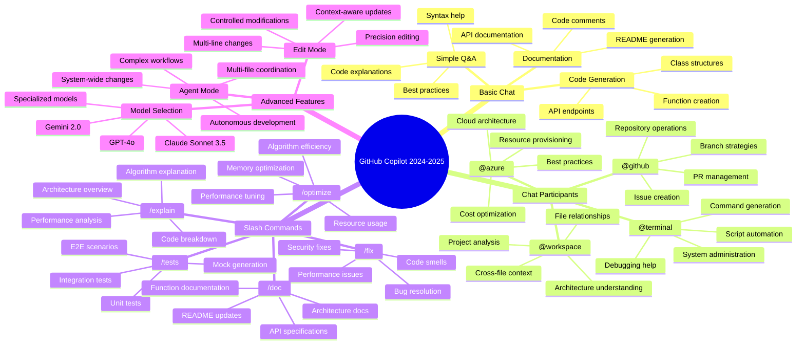
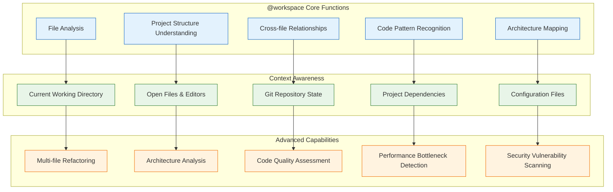
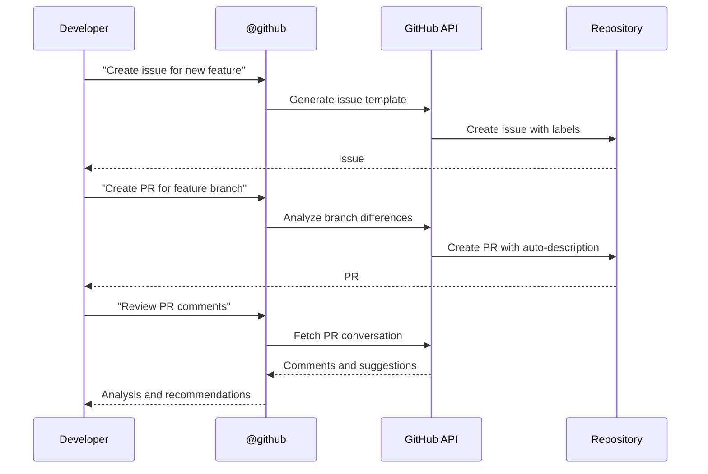
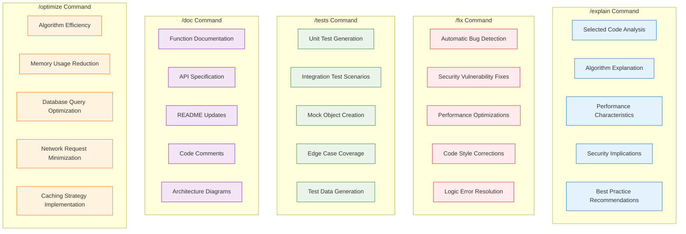
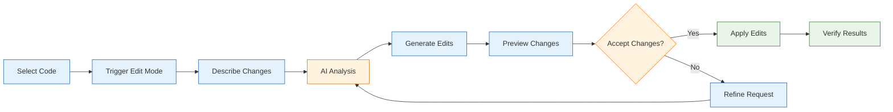
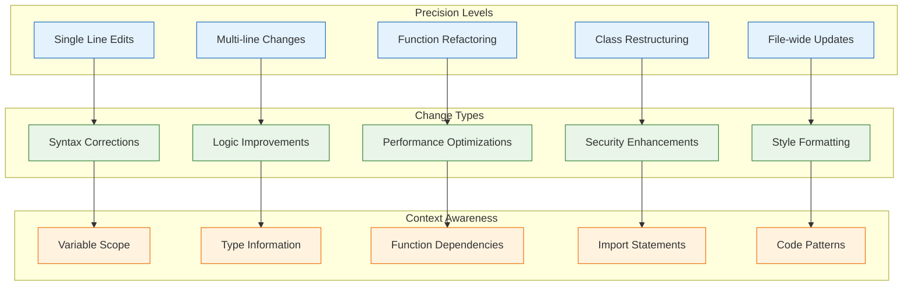
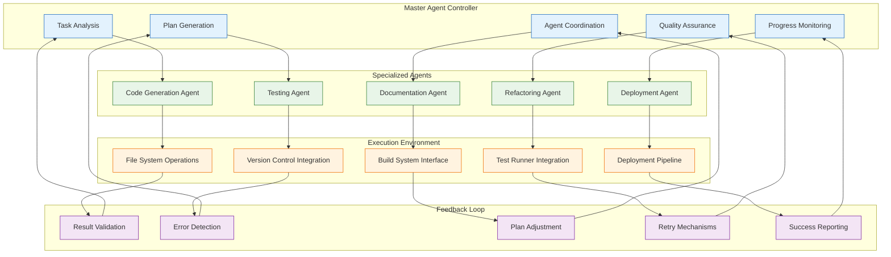
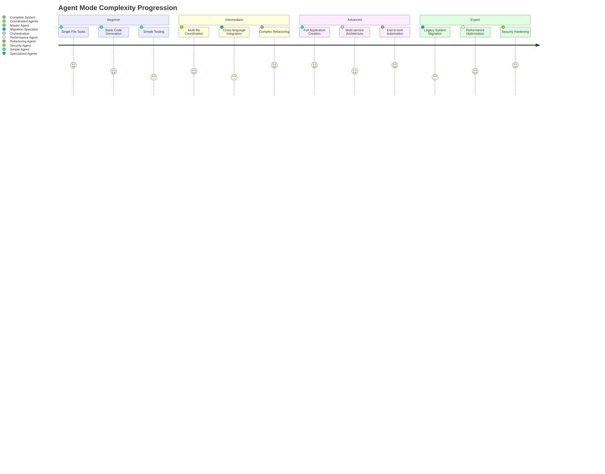
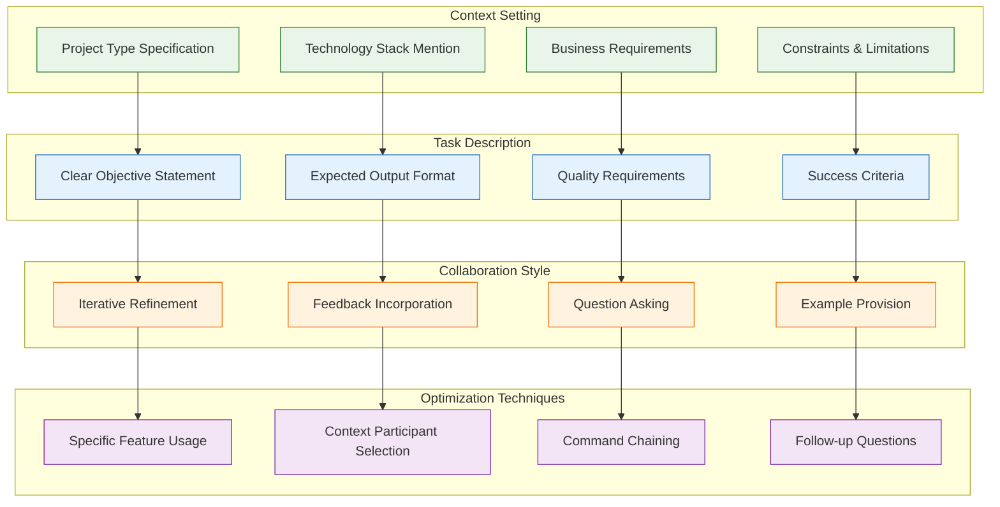
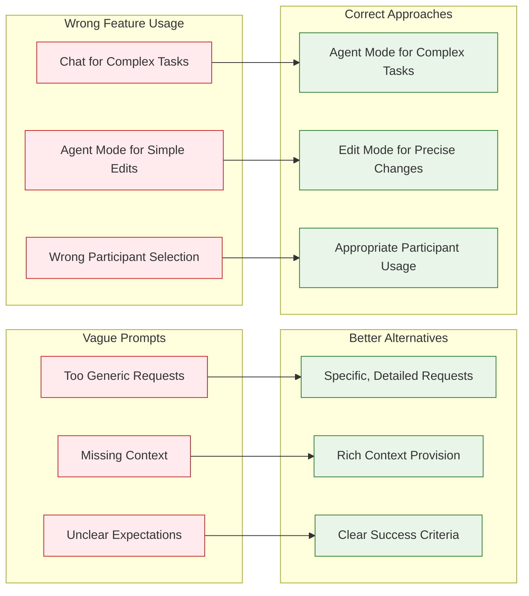

# 🚀 GitHub Copilot Features Visual Guide

This comprehensive visual guide showcases all GitHub Copilot features used throughout the workshop, with interactive diagrams and practical examples.

## 🗺️ Copilot Features Map



## 💬 Chat Participants Deep Dive

### @workspace Participant Capabilities



### @github Participant Workflow



### @terminal Participant Examples

```mermaid
graph LR
    subgraph "Command Categories"
        CC1[System Administration]
        CC2[Development Tools]
        CC3[Git Operations]
        CC4[Package Management]
        CC5[Debugging & Diagnostics]
    end

    subgraph "Generated Commands"
        GC1[sudo systemctl restart nginx]
        GC2[npm run build --production]
        GC3[git rebase -i HEAD~3]
        GC4[pip install -r requirements.txt]
        GC5[netstat -tlnp | grep :8080]
    end

    subgraph "Smart Features"
        SF1[Context-aware suggestions]
        SF2[Error resolution scripts]
        SF3[Multi-step automation]
        SF4[Platform-specific commands]
        SF5[Security-conscious defaults]
    end

    CC1 --> GC1 --> SF1
    CC2 --> GC2 --> SF2
    CC3 --> GC3 --> SF3
    CC4 --> GC4 --> SF4
    CC5 --> GC5 --> SF5

    classDef category fill:#e8f5e8,stroke:#2e7d32
    classDef command fill:#e3f2fd,stroke:#1565c0
    classDef smart fill:#fff3e0,stroke:#ef6c00

    class CC1,CC2,CC3,CC4,CC5 category
    class GC1,GC2,GC3,GC4,GC5 command
    class SF1,SF2,SF3,SF4,SF5 smart
```

## ⚡ Slash Commands Reference

### Command Usage Patterns



## 🎯 Edit Mode Workflow

### Edit Mode Process Flow



### Edit Mode Capabilities Matrix



## 🤖 Agent Mode Architecture

### Agent Mode Orchestration



### Agent Mode Complexity Levels



## 🔄 Feature Interaction Patterns

### Cross-Feature Workflow

```mermaid
graph LR
    subgraph "Discovery Phase"
        DP1[@workspace analysis]
        DP2[/explain complex code]
        DP3[Architecture understanding]
    end

    subgraph "Development Phase"
        DEV1[Agent Mode planning]
        DEV2[Edit Mode precision changes]
        DEV3[Chat participant assistance]
    end

    subgraph "Quality Phase"
        QP1[/tests generation]
        QP2[/fix bug resolution]
        QP3[/optimize performance]
    end

    subgraph "Documentation Phase"
        DOC1[/doc generation]
        DOC2[@github PR creation]
        DOC3[Architecture diagrams]
    end

    DP1 --> DEV1
    DP2 --> DEV2
    DP3 --> DEV3

    DEV1 --> QP1
    DEV2 --> QP2
    DEV3 --> QP3

    QP1 --> DOC1
    QP2 --> DOC2
    QP3 --> DOC3

    classDef discovery fill:#e8f5e8,stroke:#2e7d32
    classDef development fill:#e3f2fd,stroke:#1565c0
    classDef quality fill:#fff3e0,stroke:#ef6c00
    classDef documentation fill:#f3e5f5,stroke:#7b1fa2

    class DP1,DP2,DP3 discovery
    class DEV1,DEV2,DEV3 development
    class QP1,QP2,QP3 quality
    class DOC1,DOC2,DOC3 documentation
```

## 📊 Feature Usage Analytics

### Workshop Feature Utilization

```mermaid
graph TB
    subgraph "Session 1: SDLC"
        S1F1[@workspace: 80%]
        S1F2[/tests: 70%]
        S1F3[@github: 60%]
        S1F4[Basic Chat: 90%]
    end

    subgraph "Session 2: Modernization"
        S2F1[Edit Mode: 85%]
        S2F2[/fix: 75%]
        S2F3[@workspace: 80%]
        S2F4[/optimize: 50%]
    end

    subgraph "Session 3: DevOps"
        S3F1[@azure: 90%]
        S3F2[@terminal: 70%]
        S3F3[/doc: 65%]
        S3F4[Agent Mode: 40%]
    end

    subgraph "Session 4: Agent Mode"
        S4F1[Agent Mode: 95%]
        S4F2[Multi-file Coordination: 80%]
        S4F3[@workspace: 85%]
        S4F4[Complex Workflows: 70%]
    end

    classDef high fill:#e8f5e8,stroke:#2e7d32
    classDef medium fill:#fff3e0,stroke:#ef6c00
    classDef low fill:#ffebee,stroke:#c62828

    class S1F1,S1F4,S2F1,S2F3,S3F1,S4F1,S4F3 high
    class S1F2,S1F3,S2F2,S3F2,S3F3,S4F2,S4F4 medium
    class S2F4,S3F4 low
```

## 🎯 Best Practices Guide

### Effective Prompting Patterns



### Common Anti-patterns to Avoid

