# 🩺 Troubleshooting Flowcharts & Visual Guides

This document provides comprehensive visual troubleshooting guides for common GitHub Copilot and workshop-related issues.

## 🔧 GitHub Copilot Troubleshooting Flowchart


## 🚀 Workshop Environment Setup Issues

### Development Environment Troubleshooting


## 🌐 Network & Connectivity Issues

### Corporate Network Troubleshooting


## 🏗️ Session-Specific Troubleshooting

### Session 1: Payment Service Issues


### Session 3: DevOps Infrastructure Issues

```mermaid
flowchart TD
    A[Session 3 DevOps Issue] --> B{Azure CLI?}
    
    B -->|Problem| B1{Azure CLI Not Installed?}
    B -->|OK| C{Authentication?}
    
    B1 -->|Yes| B1A[Install Azure CLI]
    B1 -->|No| B2{Wrong Version?}
    
    B1A --> TEST1[Test az --version]
    
    B2 -->|Yes| B2A[Update Azure CLI]
    B2 -->|No| B3[Check PATH]
    
    B2A --> TEST1
    B3 --> TEST1
    
    C -->|Problem| C1{Not Logged In?}
    C -->|OK| D{Terraform?}
    
    C1 -->|Yes| C1A[az login]
    C1 -->|No| C2{Wrong Subscription?}
    
    C1A --> C1B[Verify Login Status]
    C1B --> TEST2[Test Azure Access]
    
    C2 -->|Yes| C2A[az account set --subscription]
    C2 -->|No| C3{Permission Issues?}
    
    C2A --> TEST2
    
    C3 -->|Yes| C3A[Check RBAC Permissions]
    C3 -->|No| C4[Verify Service Principal]
    
    C3A --> C3B[Request Contributor Access]
    C3B --> TEST2
    
    C4 --> TEST2
    
    D -->|Problem| D1{Terraform Not Installed?}
    D -->|OK| E{Kubernetes?}
    
    D1 -->|Yes| D1A[Install Terraform]
    D1 -->|No| D2{Init/Plan Failing?}
    
    D1A --> TEST3[Test terraform --version]
    
    D2 -->|Yes| D2A{Backend Configuration?}
    D2 -->|No| D3{Apply Failing?}
    
    D2A -->|Problem| D2B[Configure Backend Storage]
    D2A -->|OK| D2C[terraform init]
    
    D2B --> D2C
    D2C --> TEST3
    
    D3 -->|Yes| D3A[Check Resource Quotas]
    D3 -->|No| D4[Validate Terraform Code]
    
    D3A --> D3B[Request Quota Increase]
    D3B --> TEST3
    
    D4 --> TEST3
    
    E -->|Problem| E1{kubectl Not Working?}
    E -->|OK| F{Copilot Azure Integration?}
    
    E1 -->|Yes| E1A{kubectl Not Installed?}
    E1 -->|No| E2{Cluster Access?}
    
    E1A -->|Yes| E1B[Install kubectl]
    E1A -->|No| E1C[Update kubectl]
    
    E1B --> TEST4[Test kubectl version]
    E1C --> TEST4
    
    E2 -->|Problem| E2A[Get AKS Credentials]
    E2 -->|OK| E3[Test K8s Operations]
    
    E2A --> E2B[az aks get-credentials]
    E2B --> TEST4
    
    E3 --> TEST4
    
    F -->|Problem| F1{@azure Participant Issues?}
    F -->|OK| SUCCESS[✅ Session 3 Ready]
    
    F1 -->|Yes| F1A[Check Copilot Azure Extension]
    F1 -->|No| F2{Poor Terraform Suggestions?}
    
    F1A --> F1B[Update Extensions]
    F1B --> TEST5[Test @azure Commands]
    
    F2 -->|Yes| F2A[Improve Context in Prompts]
    F2 -->|No| F3[Use Terraform Documentation]
    
    F2A --> TEST5
    F3 --> TEST5
    
    TEST1 --> TEST1A{Azure CLI Working?}
    TEST2 --> TEST2A{Azure Authenticated?}
    TEST3 --> TEST3A{Terraform Working?}
    TEST4 --> TEST4A{Kubernetes Access?}
    TEST5 --> TEST5A{Copilot Azure Help?}
    
    TEST1A -->|No| B1
    TEST1A -->|Yes| C
    
    TEST2A -->|No| C1
    TEST2A -->|Yes| D
    
    TEST3A -->|No| D1
    TEST3A -->|Yes| E
    
    TEST4A -->|No| E1
    TEST4A -->|Yes| F
    
    TEST5A -->|No| F1
    TEST5A -->|Yes| SUCCESS

    classDef problem fill:#ffebee,stroke:#c62828
    classDef decision fill:#fff3e0,stroke:#ef6c00
    classDef action fill:#e3f2fd,stroke:#1565c0
    classDef test fill:#f3e5f5,stroke:#7b1fa2
    classDef success fill:#e8f5e8,stroke:#2e7d32

    class A problem
    class B,B1,B2,C,C1,C2,C3,D,D1,D2,D2A,D3,E,E1,E1A,E2,F,F1,F2,TEST1A,TEST2A,TEST3A,TEST4A,TEST5A decision
    class B1A,B2A,B3,C1A,C1B,C2A,C3A,C3B,C4,D1A,D2B,D2C,D3A,D3B,D4,E1B,E1C,E2A,E2B,E3,F1A,F1B,F2A,F3 action
    class TEST1,TEST2,TEST3,TEST4,TEST5 test
    class SUCCESS success
```

## 📞 Escalation Matrix

### Support Contact Flow

```mermaid
graph TB
    A[Issue Identified] --> B{Self-Service Possible?}
    
    B -->|Yes| B1[Check Documentation]
    B -->|No| C{Participant Help Available?}
    
    B1 --> B2{Issue Resolved?}
    B2 -->|Yes| SUCCESS[✅ Continue Workshop]
    B2 -->|No| C
    
    C -->|Yes| C1[Ask Fellow Participant]
    C -->|No| D{Facilitator Available?}
    
    C1 --> C2{Issue Resolved?}
    C2 -->|Yes| SUCCESS
    C2 -->|No| D
    
    D -->|Yes| D1[Contact Workshop Facilitator]
    D -->|No| E{Technical Support Needed?}
    
    D1 --> D2{Issue Resolved?}
    D2 -->|Yes| SUCCESS
    D2 -->|No| E
    
    E -->|Yes| E1{GitHub Copilot Issue?}
    E -->|No| F{Azure/Infrastructure Issue?}
    
    E1 -->|Yes| E1A[GitHub Support Ticket]
    E1 -->|No| E2{VS Code Issue?}
    
    E1A --> E1B[Provide Copilot Logs]
    E1B --> ESCALATED[🎫 Support Ticket Created]
    
    E2 -->|Yes| E2A[VS Code GitHub Issues]
    E2 -->|No| E3[General Technical Support]
    
    E2A --> ESCALATED
    E3 --> ESCALATED
    
    F -->|Yes| F1[Azure Support Portal]
    F -->|No| G{Network/Corporate IT?}
    
    F1 --> F2[Provide Azure Logs]
    F2 --> ESCALATED
    
    G -->|Yes| G1[Contact IT Department]
    G -->|No| H[Workshop Support Forum]
    
    G1 --> G2[Request Network Access]
    G2 --> IT_TICKET[🏢 IT Ticket Created]
    
    H --> ESCALATED

    classDef start fill:#e8f5e8,stroke:#2e7d32
    classDef decision fill:#fff3e0,stroke:#ef6c00
    classDef action fill:#e3f2fd,stroke:#1565c0
    classDef success fill:#e8f5e8,stroke:#2e7d32
    classDef escalation fill:#ffebee,stroke:#c62828
    classDef it fill:#f3e5f5,stroke:#7b1fa2

    class A start
    class B,B2,C,C2,D,D2,E,E1,E2,F,G decision
    class B1,C1,D1,E1A,E1B,E2A,E3,F1,F2,G1,G2,H action
    class SUCCESS success
    class ESCALATED escalation
    class IT_TICKET it
```



## 🎯 Prevention Strategies

### Proactive Issue Prevention

