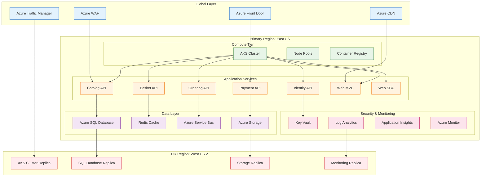

# 🚀 Session 3: Advanced DevOps with GitHub Copilot
## Building Modern E-Commerce Infrastructure with .NET eShop

[](https://dotnet.microsoft.com/)
[](https://azure.microsoft.com/)
[](https://terraform.io/)
[](https://kubernetes.io/)

> **Objective**: Learn to use GitHub Copilot for building production-ready DevOps pipelines, Infrastructure as Code, and deployment automation using Microsoft's .NET eShop reference application.

## 🎯 Session Overview

In this session, you'll leverage GitHub Copilot to:
- **Fork and setup** the [.NET eShop application](https://github.com/dotnet/eShop)
- **Generate Infrastructure as Code** using Terraform for Azure
- **Create CI/CD pipelines** with GitHub Actions
- **Deploy microservices** to Azure Kubernetes Service (AKS)
- **Implement monitoring** and observability solutions
- **Setup disaster recovery** and multi-region deployment

**Estimated Duration**: 25 minutes  
**Difficulty Level**: Intermediate to Advanced  
**Prerequisites**: Azure subscription, GitHub account, Visual Studio Code

## 🏗️ Architecture Overview

We'll deploy the .NET eShop application with this cloud-native architecture:

```
┌─────────────────────────────────────────────────────────────┐
│                    Azure Front Door + WAF                   │
│                  (Global Load Balancer)                     │
└─────────────────────┬───────────────────────────────────────┘
                      │
              ┌───────▼───────┐
              │               │
    ┌─────────▼─────┐  ┌──────▼──────┐
    │ Primary Region │  │ DR Region   │
    │   (East US)    │  │ (West US 2) │
    │                │  │             │
    │ ┌─────────────┐│  │┌───────────┐│
    │ │ AKS Cluster ││  ││AKS Cluster││
    │ │             ││  ││           ││
    │ │ eShop APIs  ││  ││eShop APIs ││
    │ │ - Catalog   ││  ││- Catalog  ││
    │ │ - Basket    ││  ││- Basket   ││
    │ │ - Ordering  ││  ││- Ordering ││
    │ │ - Payment   ││  ││- Payment  ││
    │ │ - Identity  ││  ││- Identity ││
    │ └─────────────┘│  │└───────────┘│
    │                │  │             │
    │ ┌─────────────┐│  │┌───────────┐│
    │ │ Azure SQL   ││  ││Azure SQL  ││
    │ │ (Primary)   ││  ││(Replica)  ││
    │ └─────────────┘│  │└───────────┘│
    └─────────────────┘  └─────────────┘
```

### Detailed Infrastructure Components



## 🛠️ Prerequisites Setup

### Required Tools Verification

Use GitHub Copilot to verify your environment:

```powershell
# @terminal Check if required tools are installed and show versions
# If any tools are missing, provide PowerShell installation commands

# Expected tools:
# - Azure CLI
# - Terraform  
# - kubectl
# - Helm
# - Docker Desktop
# - .NET 8 SDK
# - Git
```

### Azure Environment Setup

```bash
# Login to Azure
az login

# Set your subscription
az account set --subscription "your-subscription-id"

# Create service principal for automation
az ad sp create-for-rbac --name "eshop-devops-sp" \
  --role="Contributor" \
  --scopes="/subscriptions/YOUR_SUBSCRIPTION_ID"
```

## 📋 Step-by-Step Walkthrough (25 minutes total)

### Phase 1: Application Setup

#### 🎯 Checkpoint 3.1: Fork and Setup eShop Application
**Points**: 15 points

1. **Fork the eShop Repository**:
   ```bash
   # Fork https://github.com/dotnet/eShop to your GitHub account
   # Clone your fork locally
   git clone https://github.com/YOUR_USERNAME/eShop.git
   cd eShop
   ```

2. **Explore the Application Architecture**:
   ```
   @workspace analyze the eShop application structure and explain:
   - The microservices architecture
   - Database requirements for each service
   - API gateway configuration
   - Frontend applications (Web, Admin, Mobile)
   - Docker compose setup for local development
   
   Create a markdown summary of the key components.
   ```

3. **Local Development Setup**:
   ```
   @terminal help me set up the eShop application for local development:
   - Install required .NET dependencies
   - Configure Docker containers
   - Set up local databases
   - Start the application stack
   - Verify all services are running
   ```

#### 🎯 Checkpoint 3.2: Container Optimization  
**Points**: 10 points

1. **Optimize Dockerfiles**:
   ```
   @workspace examine the existing Dockerfiles in the eShop project and suggest optimizations for:
   - Multi-stage builds
   - Layer caching efficiency  
   - Security best practices
   - Size reduction techniques
   - Production readiness
   
   Generate improved Dockerfiles for key services.
   ```

### Phase 2: Infrastructure as Code

#### 🎯 Checkpoint 3.3: Azure Infrastructure with Terraform
**Points**: 25 points

1. **Generate Terraform Configuration**:
   ```
   @azure create production-ready Terraform configuration for the eShop platform:

   TERRAFORM STRUCTURE:
   ├── modules/
   │   ├── aks-cluster/
   │   ├── azure-sql/  
   │   ├── key-vault/
   │   ├── application-gateway/
   │   ├── redis-cache/
   │   ├── service-bus/
   │   └── monitoring/
   ├── environments/
   │   ├── dev/
   │   ├── staging/
   │   └── production/
   └── global/
       └── shared-services/

   REQUIREMENTS:
   - AKS cluster with autoscaling (3-50 nodes)
   - Azure SQL databases for each microservice
   - Azure Cache for Redis
   - Azure Service Bus for messaging
   - Application Gateway with WAF
   - Azure Key Vault for secrets
   - Azure Container Registry
   - Log Analytics and Application Insights
   - Multi-region setup (primary + DR)
   - Network security groups and private endpoints
   ```

2. **Advanced Terraform Features**:
   ```
   @azure enhance the Terraform configuration with:
   
   ADVANCED FEATURES:
   - Conditional resource creation based on environment
   - Dynamic blocks for complex configurations
   - Remote state management with Azure Storage
   - Terraform workspaces for environment isolation
   - Custom modules with versioning
   - Data sources for existing resources
   
   SECURITY FEATURES:
   - Zero-trust network architecture
   - Private endpoints for all PaaS services
   - Network isolation with VNets and subnets
   - Azure Firewall configuration
   - SSL/TLS certificate management
   - Azure AD integration
   ```

#### 🎯 Checkpoint 3.4: Kubernetes Manifests and Helm Charts
**Points**: 20 points

1. **Generate Kubernetes Manifests**:
   ```
   @workspace create Kubernetes manifests for the eShop microservices:
   
   For each service (Catalog, Basket, Ordering, Payment, Identity, WebMVC, WebSPA):
   - Deployment with resource limits and requests
   - Service (ClusterIP for internal, LoadBalancer for external)
   - HorizontalPodAutoscaler
   - PodDisruptionBudget
   - ConfigMap for application settings
   - Secret for sensitive configuration
   - NetworkPolicy for security
   - ServiceMonitor for Prometheus
   
   Include proper labeling and annotations for observability.
   ```

2. **Create Helm Charts**:
   ```
   @workspace convert the Kubernetes manifests into a comprehensive Helm chart:
   
   HELM CHART STRUCTURE:
   ├── Chart.yaml
   ├── values.yaml
   ├── values-dev.yaml
   ├── values-staging.yaml  
   ├── values-production.yaml
   └── templates/
       ├── deployments/
       ├── services/
       ├── configmaps/
       ├── secrets/
       ├── ingress/
       └── monitoring/
   
   Include:
   - Environment-specific value files
   - Templating for scalability
   - Dependencies for databases and messaging
   - Health checks and readiness probes
   - Resource quotas and limits
   - Security contexts and policies
   ```

### Phase 3: CI/CD Pipeline Automation

#### 🎯 Checkpoint 3.5: GitHub Actions Workflows
**Points**: 25 points

1. **Build and Test Pipeline**:
   ```
   @workspace create GitHub Actions workflows for the eShop application:
   
   BUILD WORKFLOW (.github/workflows/build.yml):
   - Trigger on push to main and pull requests
   - Matrix strategy for multiple .NET versions
   - Build all microservices
   - Run unit tests with coverage reporting
   - Run integration tests
   - Security scanning with CodeQL
   - Dependency vulnerability scanning
   - Build and push Docker images to ACR
   - Generate SBOM (Software Bill of Materials)
   ```

2. **Infrastructure Deployment Pipeline**:
   ```
   @azure create GitHub Actions workflow for infrastructure deployment:
   
   INFRASTRUCTURE WORKFLOW (.github/workflows/infrastructure.yml):
   - Terraform plan on pull requests
   - Terraform apply on merge to main
   - Environment approvals for production
   - Azure authentication with service principal
   - Terraform state locking
   - Drift detection and remediation
   - Cost estimation with Infracost
   - Security compliance scanning
   ```

3. **Application Deployment Pipeline**:
   ```
   @workspace create application deployment workflow:
   
   DEPLOYMENT WORKFLOW (.github/workflows/deploy.yml):
   - Environment-specific deployments (dev → staging → production)
   - Blue-green deployment strategy
   - Helm chart deployment to AKS
   - Database migration automation
   - Smoke tests after deployment
   - Rollback capability
   - Slack/Teams notifications
   - Performance testing integration
   ```

#### 🎯 Checkpoint 3.6: Advanced DevOps Practices
**Points**: 15 points

1. **GitOps with ArgoCD**:
   ```
   @workspace implement GitOps workflow:
   - Install ArgoCD on AKS cluster
   - Create Application manifests for each environment
   - Set up auto-sync policies
   - Configure webhooks for deployment notifications
   - Implement progressive delivery with Argo Rollouts
   ```

2. **Security Scanning Integration**:
   ```
   @workspace add comprehensive security scanning:
   - Container image scanning with Trivy
   - Infrastructure as Code scanning
   - Secret detection in code
   - License compliance checking
   - OWASP dependency scanning
   - Policy as Code with Open Policy Agent
   ```

### Phase 4: Monitoring and Observability

#### 🎯 Checkpoint 3.7: Comprehensive Monitoring Setup
**Points**: 20 points

1. **Azure Monitor and Application Insights**:
   ```
   @azure implement monitoring for the eShop application:
   
   MONITORING COMPONENTS:
   - Application Insights for each microservice
   - Custom metrics and telemetry
   - Distributed tracing configuration
   - Log Analytics workspace
   - Azure Monitor alerts and action groups
   - Grafana dashboards for visualization
   - Azure Service Health monitoring
   ```

2. **Prometheus and Grafana Stack**:
   ```
   @workspace deploy monitoring stack to Kubernetes:
   - Prometheus for metrics collection
   - Grafana for visualization
   - AlertManager for alert routing
   - Node Exporter for infrastructure metrics
   - Custom ServiceMonitors for application metrics
   - Pre-built dashboards for .NET applications
   - Integration with Azure Monitor
   ```

#### 🎯 Checkpoint 3.8: Disaster Recovery and Backup
**Points**: 10 points

1. **Backup Strategy Implementation**:
   ```
   @azure implement backup and disaster recovery:
   - Azure Backup for AKS persistent volumes
   - Azure SQL geo-replication
   - Application data backup automation
   - Configuration backup to Azure Storage
   - Recovery procedures documentation
   - RTO/RPO testing automation
   ```

### Phase 5: Performance and Scaling

#### 🎯 Checkpoint 3.9: Auto-scaling and Performance
**Points**: 15 points

1. **Advanced Scaling Configuration**:
   ```
   @workspace implement comprehensive scaling:
   
   SCALING STRATEGIES:
   - Horizontal Pod Autoscaler (HPA) with custom metrics
   - Vertical Pod Autoscaler (VPA)
   - Cluster Autoscaler configuration
   - Azure SQL database auto-scaling
   - Redis cache scaling policies
   - Load testing with Azure Load Testing
   - Performance benchmarking automation
   ```

2. **Performance Optimization**:
   ```
   @workspace optimize application performance:
   - Implement caching strategies
   - Database query optimization
   - CDN configuration for static assets
   - API rate limiting and throttling
   - Connection pooling optimization
   - Memory and CPU profiling integration
   ```

## 🏆 Success Criteria

### Scoring Rubric

| Component | Excellent (25pts) | Good (20pts) | Satisfactory (15pts) | Needs Improvement (10pts) |
|-----------|------------------|--------------|---------------------|---------------------------|
| **Infrastructure** | Complete multi-region setup with all Azure services | Single region with most services | Basic AKS and database setup | Minimal infrastructure |
| **CI/CD Pipeline** | Full GitOps with security scanning | Automated build/deploy | Basic CI/CD workflow | Manual deployment process |
| **Monitoring** | Comprehensive observability stack | Basic monitoring setup | Limited metrics collection | No monitoring |
| **Security** | Zero-trust with policy enforcement | Security scanning integrated | Basic security measures | Security overlooked |
| **Documentation** | Complete runbooks and diagrams | Good documentation | Basic README | Minimal documentation |

**Total Possible Points**: 150  
**Passing Score**: 105 points (70%)

## 🎓 Learning Outcomes

By completing this session, you will have learned:

✅ **Infrastructure as Code**: Advanced Terraform patterns for Azure cloud resources  
✅ **Container Orchestration**: Kubernetes and Helm for microservices deployment  
✅ **CI/CD Automation**: GitHub Actions for build, test, and deployment pipelines  
✅ **Monitoring & Observability**: Comprehensive monitoring with Azure Monitor and Prometheus  
✅ **Security Integration**: DevSecOps practices with automated security scanning  
✅ **Disaster Recovery**: Multi-region deployment and backup strategies  
✅ **Performance Optimization**: Auto-scaling and performance tuning techniques  
✅ **GitOps Practices**: Declarative deployment with ArgoCD

## 💡 Copilot Tips & Best Practices

### Effective Prompting Strategies

1. **Context-Aware Prompts**:
   ```
   @azure create AKS cluster configuration for eShop with:
   - 3-50 node auto-scaling
   - Multiple node pools for different workloads
   - Network policy support
   - Azure AD integration
   ```

2. **Multi-Step Complex Tasks**:
   ```
   @workspace help me implement the following in sequence:
   1. Create Terraform module for Azure SQL
   2. Add connection string to Key Vault
   3. Update application configuration
   4. Create database initialization script
   ```

3. **Error Resolution**:
   ```
   @azure I'm getting this Terraform error: [paste error]
   Help me diagnose and fix the issue
   ```

### Advanced Copilot Features

- **Slash Commands**: Use `@azure`, `@workspace`, `@terminal` for context-specific help
- **Multi-file Editing**: Reference multiple files in prompts for comprehensive changes
- **Documentation Generation**: Auto-generate README files and architectural diagrams
- **Code Review**: Ask Copilot to review your infrastructure code for best practices

## 🔗 Additional Resources

### Microsoft Documentation
- [.NET eShop Reference Application](https://github.com/dotnet/eShop)
- [Azure Well-Architected Framework](https://docs.microsoft.com/en-us/azure/architecture/framework/)
- [AKS Best Practices](https://docs.microsoft.com/en-us/azure/aks/best-practices)
- [Terraform Azure Provider](https://registry.terraform.io/providers/hashicorp/azurerm/latest)

### Community Resources
- [Helm Chart Best Practices](https://helm.sh/docs/chart_best_practices/)
- [Kubernetes Security Best Practices](https://kubernetes.io/docs/concepts/security/)
- [GitHub Actions Documentation](https://docs.github.com/en/actions)
- [ArgoCD Documentation](https://argo-cd.readthedocs.io/)

### Troubleshooting Guides
- [AKS Troubleshooting](https://docs.microsoft.com/en-us/azure/aks/troubleshooting)
- [Terraform Common Issues](https://www.terraform.io/docs/configuration/troubleshooting.html)
- [GitHub Actions Debugging](https://docs.github.com/en/actions/monitoring-and-troubleshooting-workflows)

## 🤝 Getting Help

- **Instructor Support**: Raise your hand for complex infrastructure issues
- **Peer Collaboration**: Work together on Terraform modules and Kubernetes manifests
- **GitHub Copilot**: Use contextual prompts for code generation and problem-solving
- **Documentation**: Refer to Azure and Kubernetes documentation for deep-dive topics

---

**Next Session**: [Session 4 - AI Agent Mode](../session-4-agent-mode/README.md)

